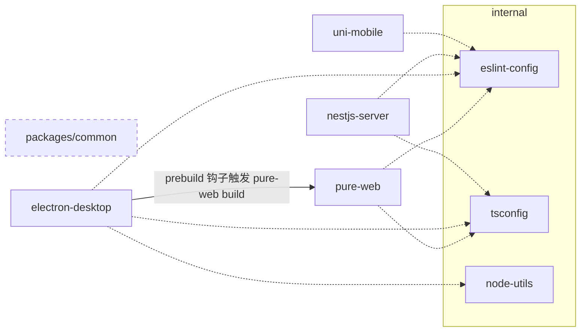

# Monorepo 结构与边界

## Workspace 布局

`pnpm-workspace.yaml` 声明三类包根：`internal/*`、`packages/*`、`apps/*`。

| Workspace | 角色 | 关键事实 |
|---|---|---|
| `apps/pure-web`（`@multi-admin/pure-web`） | Vue3 管理后台 | vue-pure-admin 基底（Element Plus + Tailwind 4 + Pinia）；开发期数据来自 `vite-plugin-fake-server`（`mock/` 目录），尚未接真实后端；`build` 产物注入 `version.json`（generate-version-file） |
| `apps/nestjs-server`（`@multi-admin/nestjs-server`） | 后端服务 | 骨架与横切基建、Prisma + Redis、认证链（JWT 双令牌轮换 + RBAC 守卫链）、system RBAC CRUD（全局软删除）与单测/e2e 合并覆盖率门禁均已交付，前端联调待 P5；jest 单测/e2e 是仓库唯一测试基建 |
| `apps/uni-mobile`（`@multi-admin/uni-mobile`） | uni-app 多端 | Vue3；Vite 版本被 named catalog `uni-app` 隔离为 5.2.8（uni-app 编译链与主仓 Vite 8 不兼容） |
| `apps/electron-desktop`（`@multi-admin/electron-desktop`） | 桌面端 | 无自身 UI，devDependencies 声明 `@multi-admin/pure-web: workspace:*`，打包时消费其 `dist` 产物；详见 [desktop-app.md](desktop-app.md) |
| `packages/common`（`@multi-admin/common`） | 跨端共享 TS 代码 | tsdown 构建；暂无应用引用 |
| `internal/node-utils` | Node 侧进程工具 | 仅导出 `run` / `runSync`（`process.mjs`），供根 `scripts/check.mjs` 等使用 |
| `internal/eslint-config` | ESLint 基线 | 导出 `base.mjs` / `node.mjs` / `vue.mjs` / `typescript.mjs` / `tailwind.mjs` 工厂，应用侧配置为薄壳 |
| `internal/stylelint-config` | Stylelint 基线 | 导出 `base.mjs` |
| `internal/tsconfig` | TS 配置基线 | `base.json` / `web.json` / `node.json` / `library.json` |

## 构建依赖关系

要点：

- **桌面端构建编排放 `electron-desktop` 的 `prebuild` 钩子**（而非根脚本或 pure-web 钩子），保证任何人单独执行 `pnpm build:desktop` 也能得到完整产物。
- pure-web 与 electron-desktop 是"产物消费"关系而非代码 import 关系：桌面端通过自定义协议托管 pure-web 的静态产物（见 [desktop-app.md](desktop-app.md)）。
- `packages/common` 目前无消费方，新增共享代码时的放置判据见下。

## 目录放置规则

- **跨端共享的业务/类型代码** → `packages/common`（先确认 ≥2 端真实消费再下沉，避免提前抽象）。
- **仅仓库工程链使用**（lint 基线、tsconfig、进程工具） → `internal/*`；命名用 npm scope `@multi-admin/<name>`，保持与应用包一致的 workspace 协议引用（`workspace:*`）。
- **单端功能** → 留在对应 app 内，不上提。

## 当前已知的结构事实（非缺陷清单，供决策参考）

- 无 CI/CD；质量门禁 = 根 `pnpm check` + husky 钩子（详见 `docs/engineering/build-and-verify.md`）。
- 前后端尚未打通：pure-web 仍走 mock（前端联调待 P5）；NestJS 已完成 Prisma + PostgreSQL + Redis 接入（`docker-compose.yml` 含 postgres/redis 服务，P1~P4 已交付）。
- 三端 TS 严格度不一致：pure-web `strict: false`（pure-admin 模板存量），uni-mobile extends `@vue/tsconfig`，nestjs-server 走内部基线。
