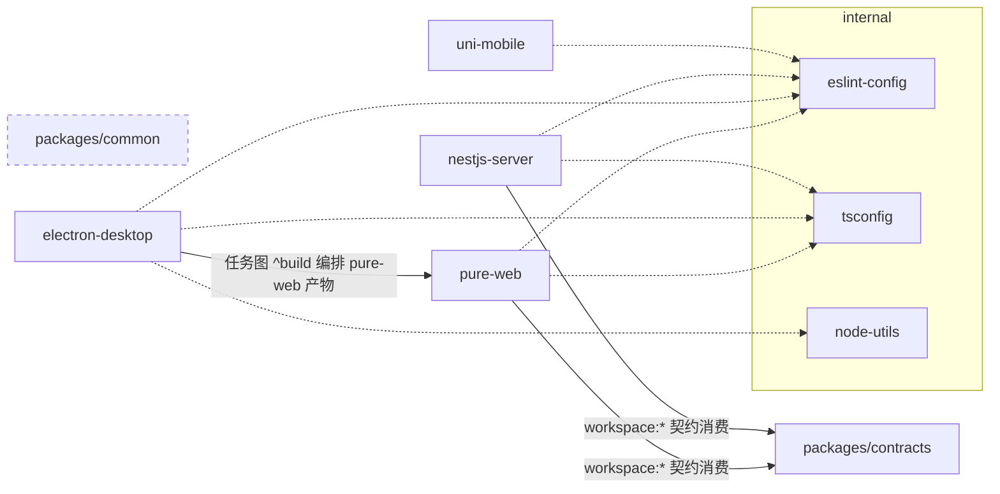

# Monorepo 结构与边界

## Workspace 布局

`pnpm-workspace.yaml` 声明三类包根：`internal/*`、`packages/*`、`apps/*`。

| Workspace | 角色 | 关键事实 |
|---|---|---|
| `apps/pure-web`（`@multi-admin/pure-web`） | Vue3 管理后台 | vue-pure-admin 基底（Element Plus + Tailwind 4 + Pinia）；数据源由 `VITE_MOCK` 切换：缺省直连 NestJS（代理 `/api/v1`），`true` 为离线 mock（契约同形，见 [contracts.md](contracts.md)）；`build` 产物注入 `version.json`（generate-version-file） |
| `apps/nestjs-server`（`@multi-admin/nestjs-server`） | 后端服务 | 骨架与横切基建、Prisma + Redis、认证链（JWT 双令牌轮换 + RBAC 守卫链）、system RBAC CRUD（全局软删除）与单测/e2e 合并覆盖率门禁均已交付，前端直连已打通（P5）；jest 单测 + e2e 串行，应用级细节见 [apps/nestjs-server/AGENTS.md](../../apps/nestjs-server/AGENTS.md) |
| `apps/uni-mobile`（`@multi-admin/uni-mobile`） | uni-app 多端 | Vue3；Vite 版本被 named catalog `uni-app` 隔离为 5.2.8（uni-app 编译链与主仓 Vite 8 不兼容） |
| `apps/electron-desktop`（`@multi-admin/electron-desktop`） | 桌面端 | 无自身 UI，devDependencies 声明 `@multi-admin/pure-web: workspace:*`，打包时消费其 `dist` 产物；详见 [desktop-app.md](desktop-app.md) |
| `packages/common`（`@multi-admin/common`） | 跨端共享 TS 代码 | tsdown 构建；暂无应用引用 |
| `packages/contracts`（`@multi-admin/contracts`） | 前后端接口契约 | 纯类型 + BizCode/MenuType 常量；tsdown ESM+CJS 双格式 + 双 d.ts；nestjs-server 与 pure-web 以 `workspace:*` 消费；见 [contracts.md](contracts.md) |
| `internal/node-utils` | Node 侧进程工具 | 仅导出 `run` / `runSync`（`process.mjs`），供根 `scripts/check.mjs` 等使用 |
| `internal/eslint-config` | ESLint 基线 | 导出 `base.mjs` / `node.mjs` / `vue.mjs` / `typescript.mjs` / `tailwind.mjs` 工厂，应用侧配置为薄壳 |
| `internal/stylelint-config` | Stylelint 基线 | 导出 `base.mjs` |
| `internal/tsconfig` | TS 配置基线 | `base.json` / `web.json` / `node.json` / `library.json` |

## 构建依赖关系

要点：

- 桌面端构建编排由 `turbo.json` 任务图承担：`build` / `build:dir` 经 `^build` 先构建 pure-web，任何入口（根命令 / `--filter`）均自动编排（决策见 ADR-005）。
- pure-web 与 electron-desktop 是"产物消费"关系而非代码 import 关系：桌面端通过自定义协议托管 pure-web 的静态产物（见 [desktop-app.md](desktop-app.md)）。
- `packages/common` 目前无消费方，新增共享代码时的放置判据见下。
- `packages/contracts` 是首个被前后端双端消费的共享包（P5）；契约扩展流程与错误码表见 [contracts.md](contracts.md)。

## 目录放置规则

- **跨端共享的业务/类型代码** → `packages/common`（先确认 ≥2 端真实消费再下沉，避免提前抽象）。
- **仅仓库工程链使用**（lint 基线、tsconfig、进程工具） → `internal/*`；命名用 npm scope `@multi-admin/<name>`，保持与应用包一致的 workspace 协议引用（`workspace:*`）。
- **单端功能** → 留在对应 app 内，不上提。

## 当前已知的结构事实（非缺陷清单，供决策参考）

- 质量门禁双层：本地 `pnpm check` + husky 钩子，GitHub CI（`.github/workflows/ci.yml`）异步兜底（详见 `docs/engineering/build-and-verify.md`）。
- 前后端已打通（P5）：pure-web 缺省直连 NestJS（`VITE_MOCK` 可切离线 mock）；dept/监控/mine-logs 为 mock-only 端点，前端降级空态（见 `docs/governance/backlog.md`）。
- TS 严格度：pure-web 已迁入单一严格配置（extends `@multi-admin/tsconfig/web.json`，`exactOptionalPropertyTypes` 暂注释），uni-mobile extends `@vue/tsconfig`，nestjs-server 走内部基线；测试分层（jest / vitest / Playwright）口径见 `docs/engineering/build-and-verify.md`。
