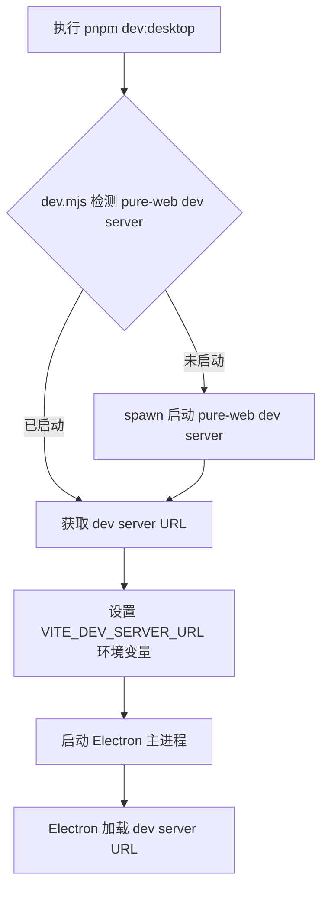

# Electron Desktop 应用设计方案

> 状态：待实现  
> 日期：2026-08-14  
> 关联应用：`apps/electron-desktop` 包装 `apps/pure-web`

---

## 1. 设计目标

在 monorepo 多端工程基架中新增桌面端应用，基于 `pure-web` 进行包装，当前实现套壳功能，预留系统能力（文件读写、系统托盘、打印机调用等）扩展接口。

### 核心原则

- **分离式架构**：`pure-web` 独立演进，`electron-desktop` 仅作为容器
- **复用逻辑，UI 独立**：桌面端与 Web 端共享业务逻辑，但视图层各自独立
- **安全优先**：严格遵循 `contextIsolation: true` + `contextBridge.exposeInMainWorld`
- **预留扩展**：IPC 通信骨架已搭建，未来系统能力扩展无需重构

---

## 2. 架构决策：分离式 vs 一体化

| 维度 | 一体化（pure-desktop） | 分离式（当前方案） |
|------|------------------------|------------------|
| **架构模式** | Electron + 前端在同一个 package | `pure-web` 独立，`electron-desktop` 独立包装 |
| **monorepo 契合度** | 与 workspace 组织方式不一致 | 职责清晰，符合 workspace 哲学 |
| **Web 部署** | 无法独立部署，前端被锁定 | `pure-web` 可独立构建部署 |
| **依赖隔离** | Electron 依赖与前端依赖混合 | 完全隔离，避免版本冲突 |
| **演进灵活性** | 被 Electron 版本约束 | 前端和桌面端各自独立升级 |
| **开发体验** | 单命令启动，略优 | 可通过脚本自动化，差距可忽略 |

**决策**：采用分离式架构。虽然开发流程稍复杂，但换来的是架构清晰度、部署灵活性和长期演进能力，这在多端工程基架中至关重要。

---

## 3. 目录结构

```
apps/electron-desktop/
├── assets/                          # 桌面端专属静态资源（图标、安装包素材等）
│   ├── icon.ico
│   └── icon.png
├── electron/
│   ├── main/
│   │   ├── index.ts                 # 主进程入口
│   │   ├── window.ts                # 窗口管理（创建、事件、状态）
│   │   └── ipc/                     # IPC 处理器（预留扩展）
│   │       ├── index.ts
│   │       └── system.ts            # 系统能力预留接口（文件、托盘、打印等）
│   └── preload/
│       └── index.ts                 # preload 脚本，安全暴露 API
├── scripts/
│   └── dev.mjs                      # 开发模式启动脚本（支持多种场景）
├── types/                           # 类型定义（独立文件夹，后续迁移到公共包）
│   └── ipc.d.ts                     # IPC API 类型声明
├── package.json
├── tsconfig.json
├── tsconfig.node.json
├── esbuild.config.mjs               # 主进程构建脚本（tsc 或 esbuild）
└── electron-builder.yml             # 打包配置
```

---

## 4. 技术栈

| 技术 | 版本 | 说明 |
|------|------|------|
| `electron` | `^37.x` | 桌面端运行时 |
| `electron-builder` | `^25.x` | 打包与分发 |
| `typescript` | `catalog:` | 复用 workspace 配置 |
| `esbuild` | `^0.x` | 主进程 TypeScript 编译 |
| `cross-env` | `^10.x` | 跨平台环境变量 |

---

## 5. 开发工作流

### 5.1 三种启动场景

`scripts/dev.mjs` 需支持以下场景：

1. **单独启动 `electron-desktop`**：脚本自动检测 `pure-web` dev server 是否运行，未运行则自动启动
2. **全局 `pnpm dev`**：根目录 `pnpm dev` 并行启动所有应用时，`electron-desktop` 应能正确识别已启动的 `pure-web`
3. **`pure-web` 已启动后启动 `electron-desktop`**：检测 dev server URL，直接启动 Electron

### 路由模式切换机制

`pure-web` 和 `electron-desktop` 支持 `history` 和 `hash` 两种路由模式切换：

- **`pure-web`**：通过 `vue-router` 的 `createWebHistory` / `createWebHashHistory` 切换
- **`electron-desktop`**：通过构建脚本注入的环境变量 `VITE_ROUTER_MODE=hash` 或 `VITE_ROUTER_MODE=history` 控制
- 生产构建时，electron-builder 打包脚本读取该环境变量，确保 Electron 加载对应模式的路由文件

### 5.2 启动流程



### 5.3 开发时 Electron 窗口加载逻辑

```ts
// 主进程入口逻辑
const devServerUrl = process.env.VITE_DEV_SERVER_URL;

if (devServerUrl) {
  // 开发模式：加载 dev server
  win.loadURL(devServerUrl);
} else {
  // 生产模式：加载本地文件
  win.loadFile(join(__dirname, '../build/web/index.html'));
}
```

---

## 6. 生产构建流程

### 6.1 构建步骤

```mermaid
graph TD
    A[pnpm build:desktop] --> B[构建 pure-web]
    B --> C[复制 pure-web/dist 到 electron-desktop/build/web/]
    C --> D[构建 Electron 主进程]
    D --> E[electron-builder 打包]
    E --> F[输出到 release/${version}/]
```

### 6.2 关键配置

- **构建产物复制**：`pure-web` 的 `dist/` 复制到 `electron-desktop/build/web/`
- **electron-builder `files`**：配置包含 `build/web/**` 和主进程产物
- **路由模式**：`pure-web` 和 `electron-desktop` 均支持 `history`/`hash` 路由切换，通过 `VITE_ROUTER_MODE` 环境变量控制

---

## 7. IPC 架构

### 7.1 安全原则

- 严格启用 `contextIsolation: true`
- 通过 `contextBridge.exposeInMainWorld` 暴露 API
- 不直接暴露 `ipcRenderer` 对象，而是封装为精细化 API

### 7.2 preload 暴露的 API

```ts
// preload/index.ts
contextBridge.exposeInMainWorld('electronAPI', {
  // 版本信息
  versions: {
    node: process.versions.node,
    electron: process.versions.electron,
    chrome: process.versions.chrome
  },

  // IPC 调用（invoke/send）
  invoke: (channel: string, ...args: any[]) => ipcRenderer.invoke(channel, ...args),
  send: (channel: string, ...args: any[]) => ipcRenderer.send(channel, ...args),

  // 监听主进程消息
  on: (channel: string, callback: (...args: any[]) => void) => {
    const handler = (_event: any, ...args: any[]) => callback(...args);
    ipcRenderer.on(channel, handler);
    return () => ipcRenderer.removeListener(channel, handler);
  },

  // 移除监听
  off: (channel: string, callback: (...args: any[]) => void) => {
    ipcRenderer.removeListener(channel, callback);
  }
});
```

### 7.3 主进程 IPC 处理器（预留扩展）

```ts
// main/ipc/index.ts
// 当前仅注册通道，未来扩展：
// - file:read / file:write（文件读写）
// - tray:create / tray:destroy（系统托盘）
// - printer:print（打印机调用）
// - system:openExternal（打开外部链接）
```

---

## 8. 窗口配置

### 8.1 基础配置

| 属性 | 值 | 说明 |
|------|------|------|
| 默认宽度 | 1280 | 初始窗口宽度 |
| 默认高度 | 800 | 初始窗口高度 |
| 最小宽度 | 800 | 用户可自由调整的最小宽度 |
| 最小高度 | 600 | 用户可自由调整的最小高度 |
| 可调整大小 | 是 | 支持最大化、最小化、手动调整 |
| 标题 | 动态 | 默认使用 app 名称 |
| 图标 | assets/icon.ico | 桌面端专属图标 |

### 8.2 菜单配置

- **开发环境**：保留完整菜单（包含"开发者工具"）
- **生产环境**：精简菜单，移除"开发者工具"
- **DevTools 打开方式**：通过菜单手动触发（非自动打开）

---

## 9. 资源管理

### 9.1 资源归属

| 资源类型 | 位置 | 说明 |
|---------|------|------|
| 窗口图标、任务栏图标 | `electron-desktop/assets/` | Electron 专属 |
| 安装包图标（.ico/.icns） | `electron-desktop/assets/` | 打包工具需要 |
| 应用内 logo、图片 | `pure-web/src/assets/` | 前端渲染资源 |

### 9.2 环境感知

`pure-web` 通过以下方式检测是否在 Electron 环境中：

```ts
// 运行时检测（方式 A）
const isElectron = typeof window.electronAPI !== 'undefined';

// 构建时优化（方式 C）
const isElectronBuild = import.meta.env.VITE_IS_ELECTRON === 'true';
```

---

## 10. 安全策略

| 配置 | 值 | 说明 |
|------|------|------|
| `contextIsolation` | `true` | 启用上下文隔离 |
| `contextBridge.exposeInMainWorld` | 使用 | 安全暴露 API |
| `nodeIntegration` | `false` | 禁用 Node.js 集成 |
| `webSecurity` | `true` | 启用同源策略（开发时可按需调整） |
| CSP | 配置 | 生产环境配置 Content-Security-Policy |

---

## 11. 版本管理

- **`pure-web` 与 `electron-desktop` 版本独立演进**
- 无强制同步要求
- **版本对应关系记录方式**：在 `electron-desktop/package.json` 的 `devDependencies` 中通过 `workspace:*` 引用 `@multi-admin/pure-web`，并在 `build.mjs` 构建脚本中记录当前构建时使用的 `pure-web` 具体版本号（写入 `build/web/version.json`）
- 发布 desktop 时，在 `CHANGELOG.md` 和 release notes 中标注依赖的 `pure-web` 版本范围

---

## 12. 自动更新预留

当前阶段不启用自动更新，但 `electron-builder.yml` 中预留配置注释：

```yaml
# publish:
#   provider: "github"
#   releaseType: "release"
#   owner: "<owner>"
#   repo: "<repo>"
```

未来启用时只需取消注释并填写发布配置。

---

## 13. 根 Workspace 脚本扩展

在根 `package.json` 中新增：

```json
{
  "scripts": {
    "dev:desktop": "pnpm --filter @multi-admin/electron-desktop run dev",
    "build:desktop": "pnpm --filter @multi-admin/electron-desktop run build",
    "build:web": "pnpm --filter @multi-admin/pure-web run build"
  }
}
```

---

## 14. 风险与应对措施

| 风险 | 影响 | 应对措施 |
|------|------|---------|
| `pure-web` 路由模式变更 | 桌面端路由加载异常 | `electron-desktop` 支持路由模式切换 |
| `pure-web` build 产物路径变更 | 复制脚本失败 | 通过 workspace 协议锁定版本，产物路径约定化 |
| Electron 版本升级兼容性 | API 变更导致构建失败 | 锁定 Electron 主版本，升级时先验证 |
| IPC 通道命名冲突 | 通信异常 | 命名空间约定：`domain:action`（如 `file:read`） |

---

## 15. 未来扩展清单（非当前实现）

- [ ] 文件读写（`file:read`、`file:write`）
- [ ] 系统托盘（`tray:create`、`tray:destroy`）
- [ ] 打印机调用（`printer:print`）
- [ ] 自动更新（GitHub Releases / 自建服务器）
- [ ] 多窗口管理
- [ ] 窗口状态持久化（位置、尺寸记忆）
- [ ] 深色模式跟随系统
- [ ] 全局快捷键

---

## 附录

### A. 参考项目

- `pure-desktop`（官方模板）：`D:\WorkSpace\04Repositories\01Git\pure-desktop`

### B. 相关文档

- [Electron 安全最佳实践](https://www.electronjs.org/docs/latest/tutorial/security)
- [electron-builder 配置指南](https://www.electron.build/configuration/configuration)
- [Vite + Electron 分离式构建](https://vitejs.dev/guide/build.html)
