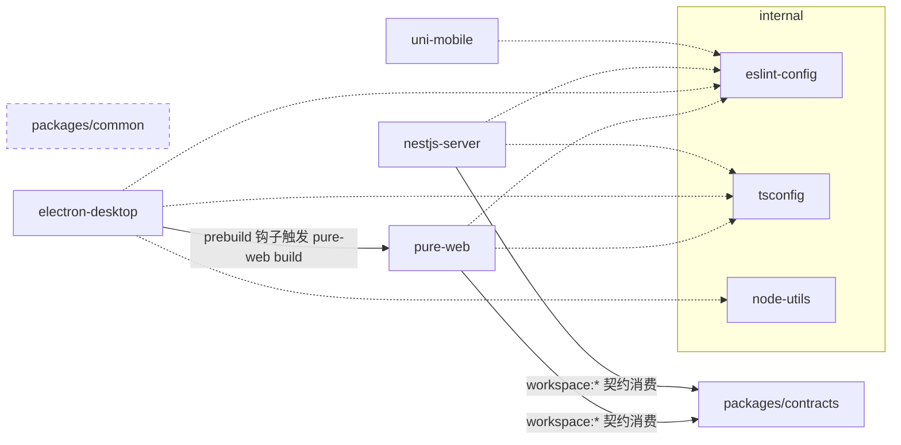

# NestJS 后端基架补全 P5 实施计划：contracts 与前端直连对齐

> **For agentic workers:** REQUIRED SUB-SKILL: Use superpowers:subagent-driven-development (recommended) or superpowers:executing-plans to implement this plan task-by-task. Steps use checkbox (`- [ ]`) syntax for tracking.

**Goal:** P5 结束时 pure-web 开发模式直连真实后端（登录/动态路由/system 三域 CRUD + 详情/mine profile 全走真库），`packages/contracts` 成为前后端契约唯一事实源，mock 降级为 `VITE_MOCK` 离线开关。

**Architecture:** 横向分层五层推进——① contracts 建包（tsdown ESM+CJS+dts，通用层/域层两级）→ ② server 契约迁移 + 三详情端点 + User.description 迁移 + profile 端点 + seed 裁剪 → ③ pure-web api/页面适配 → ④ vite proxy 直连 + mock 契约同形升级 → ⑤ 文档收尾与任务域归档。

**Tech Stack:** pnpm workspace / tsdown / NestJS + Prisma 7 + PostgreSQL / Vue3 + Vite + Element Plus / jest + supertest。

**分设计**：[2026-08-21-nestjs-backend-foundation-phase5-design.md](./2026-08-21-nestjs-backend-foundation-phase5-design.md)（下称「分设计」，章节号 §x.x 均指该文档）。

**前置条件**：`docker compose up -d postgres redis`（或等效服务）已运行；`apps/nestjs-server/.env` 已按 `.env.example` 配置。

**提交规范**：conventional commits + scope 白名单（contracts 包用 `common`；前端 `web`；后端 `server`；文档 `docs`）。提交信息写入 `.git/COMMIT_MSG` 后 `git commit -F .git/COMMIT_MSG`（规避 shell 转义）。

---

### Task 1: contracts 包骨架 + 通用层

**Files:**
- Create: `packages/contracts/package.json`
- Create: `packages/contracts/tsconfig.json`
- Create: `packages/contracts/tsdown.config.ts`
- Create: `packages/contracts/src/common/envelope.ts`
- Create: `packages/contracts/src/common/biz-code.ts`
- Create: `packages/contracts/src/common/pagination.ts`
- Create: `packages/contracts/src/common/conventions.ts`
- Create: `packages/contracts/src/index.ts`

- [ ] **Step 1: 创建 package.json（照搬 packages/common 模板，仅改名与描述）**

```json
{
  "name": "@multi-admin/contracts",
  "version": "0.1.0",
  "private": true,
  "description": "多端管理系统 - 前后端契约包（纯类型 + 常量，零运行时依赖）",
  "main": "./dist/index.cjs",
  "module": "./dist/index.js",
  "types": "./dist/index.d.ts",
  "exports": {
    ".": {
      "types": "./dist/index.d.ts",
      "import": {
        "types": "./dist/index.d.ts",
        "default": "./dist/index.js"
      },
      "require": {
        "types": "./dist/index.d.cts",
        "default": "./dist/index.cjs"
      }
    }
  },
  "files": [
    "dist"
  ],
  "scripts": {
    "dev": "tsdown --watch",
    "build": "tsdown",
    "typecheck": "tsc --noEmit"
  },
  "keywords": [],
  "author": "",
  "license": "ISC",
  "type": "module",
  "devDependencies": {
    "@multi-admin/tsconfig": "workspace:*",
    "tsdown": "catalog:"
  }
}
```

- [ ] **Step 2: 创建 tsconfig.json 与 tsdown.config.ts**

`packages/contracts/tsconfig.json`：

```json
{
  "extends": "@multi-admin/tsconfig/library.json",
  "compilerOptions": {
    "rootDir": "./src"
  },
  "include": ["src"],
  "exclude": ["node_modules", "dist"]
}
```

`packages/contracts/tsdown.config.ts`：

```ts
import { defineConfig } from 'tsdown';

export default defineConfig({
  entry: ['src/index.ts'],
  // ESM + CJS 双格式：消费方横跨 Vite（ESM）、Nest（type: module）、jest（CJS）
  format: ['esm', 'cjs'],
  // 生成 .d.ts（ESM 对应 index.d.ts，CJS 对应 index.d.cts）
  dts: true,
  clean: true,
  target: 'es2022',
  platform: 'neutral'
});
```

- [ ] **Step 3: 通用层四个文件**

`packages/contracts/src/common/envelope.ts`：

```ts
/** 统一响应信封（总 spec §5）：所有端点成功响应均为该形状 */
export interface ApiResponse<T> {
  code: number;
  message: string;
  data: T;
}
```

`packages/contracts/src/common/biz-code.ts`（自 nestjs-server `src/common/errors/biz-code.ts` 原样迁入）：

```ts
/**
 * 统一业务错误码（总 spec §5）。码段规则：前 3 位对齐 HTTP 语义，
 * httpStatus = Math.floor(code / 100)。
 */
export const BizCode = {
  SUCCESS: 0,
  VALIDATION_FAILED: 40001,
  UNAUTHORIZED: 40101,
  ACCESS_TOKEN_EXPIRED: 40102,
  REFRESH_TOKEN_INVALID: 40103,
  FORBIDDEN: 40301,
  NOT_FOUND: 40404,
  CONFLICT: 40900,
  RATE_LIMITED: 42901,
  INTERNAL_ERROR: 50000
} as const;

export type BizCodeValue = (typeof BizCode)[keyof typeof BizCode];
```

`packages/contracts/src/common/pagination.ts`：

```ts
/** 分页查询参数（query 参数；server 端 DTO 做 @Min/@Max 钳制） */
export interface PageQuery {
  page?: number;
  pageSize?: number;
}

/** 分页响应（仅 user/role 列表；menu 全量树与 roles/all 不分页） */
export interface PageResult<T> {
  items: T[];
  total: number;
  page: number;
  pageSize: number;
}
```

`packages/contracts/src/common/conventions.ts`：

```ts
/** ISO 8601 时间字符串：全库统一的时间表达（Date 经 JSON 序列化后的形态） */
export type IsoDateTimeString = string;

/** 资源 id：cuid 字符串 */
export type EntityId = string;
```

- [ ] **Step 4: 桶导出（Task 2 会补域层导出）**

`packages/contracts/src/index.ts`：

```ts
export * from './common/envelope.js';
export * from './common/biz-code.js';
export * from './common/pagination.js';
export * from './common/conventions.js';
```

- [ ] **Step 5: 安装依赖并验证构建**

Run: `pnpm install && pnpm --filter @multi-admin/contracts run build && pnpm --filter @multi-admin/contracts run typecheck`
Expected: 构建成功，`packages/contracts/dist/` 生成 `index.js` / `index.cjs` / `index.d.ts` / `index.d.cts`；typecheck 无错误。若 `dist/` 未被 git 忽略，检查根 `.gitignore` 是否含 `packages/*/dist`（与 common 同待遇），缺则补。

- [ ] **Step 6: Commit**

```
feat(common): 新建 contracts 契约包骨架与通用层（信封/错误码/分页/约定）
```

---

### Task 2: contracts auth 域 + system 域类型

**Files:**
- Create: `packages/contracts/src/auth/index.ts`
- Create: `packages/contracts/src/system/user.ts`
- Create: `packages/contracts/src/system/role.ts`
- Create: `packages/contracts/src/system/menu.ts`
- Create: `packages/contracts/src/system/index.ts`
- Modify: `packages/contracts/src/index.ts`

- [ ] **Step 1: auth 域**

`packages/contracts/src/auth/index.ts`：

```ts
/** 登录请求（POST /api/v1/auth/login） */
export interface LoginRequest {
  username: string;
  password: string;
}

/**
 * 对外令牌载荷：登录响应的令牌部分与刷新响应同形。
 * server 内部 TokenPair 含 sid，对外契约不含（refresh 端点剥离）。
 */
export interface TokenPayload {
  accessToken: string;
  refreshToken: string;
  /** access 过期的毫秒时间戳 */
  expires: number;
}

/** 认证画像：登录响应 = 画像 + 令牌载荷 */
export interface AuthProfile {
  avatar: string | null;
  username: string;
  nickname: string;
  roles: string[];
  permissions: string[];
}

export type LoginResponse = AuthProfile & TokenPayload;

/** 刷新响应（POST /api/v1/auth/refresh-token） */
export type RefreshResponse = TokenPayload;

/** mine 域个人信息（GET /api/v1/auth/profile，决策 #10） */
export interface UserProfile {
  avatar: string | null;
  username: string;
  nickname: string;
  email: string | null;
  phone: string | null;
  description: string | null;
}

/** 动态路由节点 meta：内置字段 + meta Json 透传字段（索引签名收纳） */
export interface AsyncRouteMeta {
  title: string;
  icon?: string;
  rank?: number;
  roles?: string[];
  showLink?: boolean;
  [key: string]: unknown;
}

/** 动态路由节点（GET /api/v1/auth/get-async-routes） */
export interface AsyncRouteNode {
  path: string;
  name?: string;
  component?: string;
  meta: AsyncRouteMeta;
  children?: AsyncRouteNode[];
}
```

- [ ] **Step 2: system/user.ts**

```ts
import type { EntityId, IsoDateTimeString } from '../common/conventions.js';
import type { PageQuery } from '../common/pagination.js';

export type UserStatus = 'ACTIVE' | 'DISABLED';

/** 用户视图（剔除 password；roles 为角色 code 数组） */
export interface UserVO {
  id: EntityId;
  username: string;
  nickname: string;
  status: UserStatus;
  avatar: string | null;
  phone: string | null;
  email: string | null;
  sex: 0 | 1 | null;
  remark: string | null;
  roles: string[];
  createdAt: IsoDateTimeString;
  updatedAt: IsoDateTimeString;
}

/** 用户列表查询（GET /api/v1/system/users） */
export interface UserQuery extends PageQuery {
  username?: string;
  status?: UserStatus;
}

export interface CreateUserRequest {
  username: string;
  password: string;
  nickname: string;
  status?: UserStatus;
  avatar?: string;
  phone?: string;
  email?: string;
  sex?: 0 | 1;
  remark?: string;
  roleIds?: EntityId[];
}

/** 护栏 6：不含 username（不可改） */
export interface UpdateUserRequest {
  nickname?: string;
  status?: UserStatus;
  avatar?: string;
  phone?: string;
  email?: string;
  sex?: 0 | 1;
  remark?: string;
  password?: string;
  roleIds?: EntityId[];
}

/** PUT /api/v1/system/users/:id/roles */
export interface SetUserRolesRequest {
  roleIds: EntityId[];
}
```

- [ ] **Step 3: system/role.ts**

```ts
import type { EntityId, IsoDateTimeString } from '../common/conventions.js';
import type { PageQuery } from '../common/pagination.js';

export type RoleStatus = 'ACTIVE' | 'DISABLED';

export interface RoleVO {
  id: EntityId;
  code: string;
  name: string;
  status: RoleStatus;
  remark: string | null;
  createdAt: IsoDateTimeString;
  updatedAt: IsoDateTimeString;
}

/** 用户页下拉选项（GET /api/v1/system/roles/all，不分页数组） */
export interface RoleOption {
  id: EntityId;
  name: string;
  code: string;
}

export interface RoleQuery extends PageQuery {
  name?: string;
  code?: string;
  status?: RoleStatus;
}

export interface CreateRoleRequest {
  code: string;
  name: string;
  status?: RoleStatus;
  remark?: string;
  menuIds?: EntityId[];
}

/** 护栏：不含 code（不可改） */
export interface UpdateRoleRequest {
  name?: string;
  status?: RoleStatus;
  remark?: string;
  menuIds?: EntityId[];
}

/** PUT /api/v1/system/roles/:id/menus */
export interface AssignRoleMenusRequest {
  menuIds: EntityId[];
}
```

- [ ] **Step 4: system/menu.ts**

```ts
import type { EntityId, IsoDateTimeString } from '../common/conventions.js';

/** 菜单类型（后端枚举为事实源；前端数字映射见 pure-web 常量） */
export const MenuType = {
  MENU: 'MENU',
  IFRAME: 'IFRAME',
  EXTERNAL: 'EXTERNAL',
  BUTTON: 'BUTTON'
} as const;

export type MenuTypeValue = (typeof MenuType)[keyof typeof MenuType];

/** 前端路由元数据（meta Json 单列的 12 个纯展示字段） */
export interface MenuMeta {
  redirect?: string;
  extraIcon?: string;
  enterTransition?: string;
  leaveTransition?: string;
  activePath?: string;
  auths?: string[];
  frameSrc?: string;
  frameLoading?: boolean;
  keepAlive?: boolean;
  hiddenTag?: boolean;
  fixedTag?: boolean;
  showParent?: boolean;
}

/** 菜单视图（= Menu 行全字段 JSON 序列化形态 + children） */
export interface MenuVO {
  id: EntityId;
  parentId: EntityId | null;
  type: MenuTypeValue;
  name: string;
  title: string;
  icon: string | null;
  path: string | null;
  component: string | null;
  permission: string | null;
  sort: number;
  visible: boolean;
  meta: MenuMeta | null;
  createdAt: IsoDateTimeString;
  updatedAt: IsoDateTimeString;
  deletedAt: IsoDateTimeString | null;
  children: MenuVO[];
}

export interface CreateMenuRequest {
  type: MenuTypeValue;
  parentId?: EntityId | null;
  name: string;
  title: string;
  icon?: string;
  path?: string;
  component?: string;
  permission?: string;
  sort?: number;
  visible?: boolean;
  meta?: MenuMeta;
}

export interface UpdateMenuRequest {
  type?: MenuTypeValue;
  parentId?: EntityId | null;
  name?: string;
  title?: string;
  icon?: string;
  path?: string;
  component?: string;
  permission?: string | null;
  sort?: number;
  visible?: boolean;
  meta?: MenuMeta | null;
}
```

- [ ] **Step 5: 域桶导出 + 主桶补域层**

`packages/contracts/src/system/index.ts`：

```ts
export * from './user.js';
export * from './role.js';
export * from './menu.js';
```

`packages/contracts/src/index.ts` 追加：

```ts
export * from './auth/index.js';
export * from './system/index.js';
```

- [ ] **Step 6: 构建验证 + Commit**

Run: `pnpm --filter @multi-admin/contracts run build && pnpm --filter @multi-admin/contracts run typecheck`
Expected: 成功，d.ts 中含全部类型。

```
feat(common): contracts 补 auth 域与 system 三域契约类型
```

---

### Task 3: 双端消费接线与构建链保障

**Files:**
- Modify: `apps/nestjs-server/package.json`
- Modify: `apps/pure-web/package.json`

- [ ] **Step 1: nestjs-server 接线**

`apps/nestjs-server/package.json`：
- `dependencies` 增（按字母序插入 `@nestjs/common` 之前）：`"@multi-admin/contracts": "workspace:*"`；
- `pretypecheck` 改为：`"prisma generate && pnpm --filter @multi-admin/contracts run build"`；
- `pretest` 改为：`"prisma generate && pnpm --filter @multi-admin/contracts run build"`。

（`build` 链不动：根 `pnpm build` 走 `pnpm -r run build` 拓扑序，contracts 先于消费方。）

- [ ] **Step 2: pure-web 接线**

`apps/pure-web/package.json`：
- `dependencies` 增（按字母序插入 `@pureadmin/descriptions` 之后）：`"@multi-admin/contracts": "workspace:*"`；
- `scripts` 增：`"pretypecheck": "pnpm --filter @multi-admin/contracts run build"`（pnpm 自动在 `typecheck` 前执行）。

- [ ] **Step 3: 安装并双端 typecheck**

Run: `pnpm install && pnpm --filter @multi-admin/nestjs-server run typecheck && pnpm --filter @multi-admin/pure-web run typecheck`
Expected: 双端 typecheck 通过（此时尚未引用 contracts，仅验证接线不破坏现状）。

- [ ] **Step 4: Commit**

```
feat(repo): 双端接线 contracts 包（workspace:* + typecheck 前置构建链）
```

---

### Task 4: server 迁移 BizCode 与 ApiResponse（原址删除）

**Files:**
- Delete: `apps/nestjs-server/src/common/errors/biz-code.ts`
- Modify: `apps/nestjs-server/src/common/errors/biz-code.spec.ts`
- Modify: `apps/nestjs-server/src/common/interceptors/response-envelope.interceptor.ts`
- Modify: 所有 `../errors/biz-code.js` import 处（Step 1 命令枚举）

- [ ] **Step 1: 枚举全部 import 点**

Run: `rg -l "errors/biz-code" apps/nestjs-server/src`
Expected: 列出 biz.exception.ts / exception-resolver.ts / response-envelope.interceptor.ts / auth.service.ts / token.service.ts / user.service.ts / role.service.ts / menu.service.ts 等（以实际输出为准，逐一修改，不遗漏）。

- [ ] **Step 2: 逐文件替换 import**

将每个文件中的：

```ts
import { BizCode } from '...相对路径.../errors/biz-code.js';
```

替换为：

```ts
import { BizCode } from '@multi-admin/contracts';
```

（仅 import 语句变化，使用处不动。）

- [ ] **Step 3: 删除 biz-code.ts 原址**

Delete: `apps/nestjs-server/src/common/errors/biz-code.ts`

- [ ] **Step 4: biz-code.spec.ts 改从 contracts 引入**

将 `biz-code.spec.ts` 顶部的相对路径 import 改为 `import { BizCode } from '@multi-admin/contracts';`，其余断言（码段规则 httpStatus = Math.floor(code / 100)）不动。

- [ ] **Step 5: response-envelope 改用契约类型**

`response-envelope.interceptor.ts`：删除本地 `export interface ApiResponse<T> {...}`（第 11-15 行）与其上方注释「类型将同步导出至 packages/contracts（P5）」，改为：

```ts
import type { ApiResponse } from '@multi-admin/contracts';
```

若该接口被其他文件 import（Run: `rg -l "response-envelope.interceptor" apps/nestjs-server/src` 排查；typecheck 会兜底暴露），将其改为从 `@multi-admin/contracts` 引入。

- [ ] **Step 6: 验证**

Run: `pnpm --filter @multi-admin/nestjs-server run typecheck && pnpm --filter @multi-admin/nestjs-server run test`
Expected: typecheck 通过；单测全绿（biz-code.spec / envelope.spec 等照常通过）。

- [ ] **Step 7: Commit**

```
refactor(server): BizCode 与 ApiResponse 迁移至 contracts 并删除原址
```

---

### Task 5: auth 域契约消费 + refresh 剥离 sid + 契约一致性单测

**Files:**
- Modify: `apps/nestjs-server/src/modules/auth/auth.service.ts`
- Modify: `apps/nestjs-server/src/modules/auth/dto/login.dto.ts`
- Create: `apps/nestjs-server/src/modules/auth/auth.contract.spec.ts`
- Modify: `apps/nestjs-server/test/auth.e2e-spec.ts`

- [ ] **Step 1: refresh 剥离 sid**

`auth.service.ts` 中 `refresh` 方法改为（返回类型与剥离动作显式化）：

```ts
  /** 轮换：旧 refresh 立即失效；用户已删/禁用 → 40103；对外剥离内部 sid */
  async refresh(refreshToken: string): Promise<RefreshResponse> {
    const claims = await this.tokens.verifyRefreshToken(refreshToken);
    const user = await this.prisma.user.findUnique({
      where: { id: claims.sub }
    });
    if (!user || user.deletedAt !== null || user.status !== 'ACTIVE') {
      throw new BizException(BizCode.REFRESH_TOKEN_INVALID, '会话用户不可用');
    }
    const pair = await this.tokens.rotate(claims, {
      id: user.id,
      username: user.username
    });
    return {
      accessToken: pair.accessToken,
      refreshToken: pair.refreshToken,
      expires: pair.expires
    };
  }
```

文件顶部增 import：`import type { RefreshResponse } from '@multi-admin/contracts';`

- [ ] **Step 2: LoginDto 编译期绑定契约**

`login.dto.ts` 末尾追加（class-validator DTO 留 server，形状以契约钉住）：

```ts
import type { LoginRequest } from '@multi-admin/contracts';

/** 编译期契约一致性：DTO 形状漂移即编译失败 */
type _LoginDtoSatisfies = LoginDto extends LoginRequest ? true : never;
const _check: _LoginDtoSatisfies = true;
void _check;
```

注意：若 ESLint `no-unused-vars` 报 `_check`，改名前缀已是下划线（仓库 eslint 配置对 `_` 前缀豁免；若仍报，改为 `expect` 无关的 `export {}` 形式并在 lint 通过后确认）。

- [ ] **Step 3: auth 域契约一致性单测**

`apps/nestjs-server/src/modules/auth/auth.contract.spec.ts`：

```ts
// auth 域契约一致性（分设计 §3.3 第 3 件）：
// 编译期钉住 server 产物形状与 contracts 一致，漂移即红。
import type {
  LoginResponse,
  RefreshResponse,
  UserProfile
} from '@multi-admin/contracts';
import type { TokenPair } from './token.service.js';

/** JSON 序列化后的类型映射：Date → string（与 HTTP 响应体一致） */
type Serialized<T> = T extends Date
  ? string
  : T extends Array<infer U>
    ? Array<Serialized<U>>
    : T extends object
      ? { [K in keyof T]: Serialized<T[K]> }
      : T;

describe('auth 域契约一致性', () => {
  it('refresh 对外形状 = TokenPair 剥离 sid', () => {
    const pair: Omit<TokenPair, 'sid'> = {
      accessToken: 'a',
      refreshToken: 'r',
      expires: Date.now()
    };
    const exposed: RefreshResponse = pair; // 编译期钉住
    expect(exposed).not.toHaveProperty('sid');
  });

  it('登录响应 = 画像 + 令牌载荷（序列化形态）', () => {
    const body = {
      avatar: null,
      username: 'admin',
      nickname: '超级管理员',
      roles: ['admin'],
      permissions: ['*:*:*'],
      accessToken: 'a',
      refreshToken: 'r',
      expires: Date.now()
    };
    const login: LoginResponse = body; // 编译期钉住
    expect(login.expires).toEqual(expect.any(Number));
  });

  it('UserProfile 四新字段可空', () => {
    const profile: UserProfile = {
      avatar: null,
      username: 'admin',
      nickname: '超级管理员',
      email: null,
      phone: null,
      description: null
    };
    expect(profile.description).toBeNull();
  });

  it('Serialized 映射自检（Date → string）', () => {
    type Check = Serialized<{ at: Date }>;
    const v: Check = { at: '2026-08-22T00:00:00.000Z' };
    expect(typeof v.at).toBe('string');
  });
});
```

- [ ] **Step 4: e2e 补 sid 剥离断言**

`test/auth.e2e-spec.ts` 中 refresh 成功用例（Run: `rg -n "refresh-token" apps/nestjs-server/test/auth.e2e-spec.ts` 定位）在断言 accessToken/refreshToken/expires 之后追加：

```ts
    expect(res.body.data).not.toHaveProperty('sid');
```

（变量名以该用例实际为准；若原用例断言了 sid 存在，改为上述反向断言。）

- [ ] **Step 5: 验证**

Run: `pnpm --filter @multi-admin/nestjs-server run test -- src/modules/auth/auth.contract.spec.ts`
Expected: PASS。随后 `pnpm --filter @multi-admin/nestjs-server run test` 全绿。
（e2e 需要 postgres/redis；可先跑 `pnpm --filter @multi-admin/nestjs-server run test:e2e -- auth` 验证，或在 Task 10 统一回归。）

- [ ] **Step 6: Commit**

```
feat(server): refresh 响应剥离内部 sid 并落 auth 域契约一致性单测
```

---

### Task 6: user/role 详情端点 GET /:id

**Files:**
- Modify: `apps/nestjs-server/src/modules/system/user/user.service.ts`
- Modify: `apps/nestjs-server/src/modules/system/user/user.controller.ts`
- Modify: `apps/nestjs-server/src/modules/system/role/role.service.ts`
- Modify: `apps/nestjs-server/src/modules/system/role/role.controller.ts`
- Modify: `apps/nestjs-server/src/modules/system/user/user.service.spec.ts`
- Modify: `apps/nestjs-server/src/modules/system/role/role.service.spec.ts`
- Create: `apps/nestjs-server/src/modules/system/user/user.contract.spec.ts`
- Create: `apps/nestjs-server/src/modules/system/role/role.contract.spec.ts`

- [ ] **Step 1: user.service 增 findOne（复用既有 findAliveUser，天然 40404）**

`user.service.ts` 在 `roleIdsOf` 之前插入：

```ts
  /** 详情（P5 分设计 §4.2）：不存在/已软删 → 40404（findAliveUser 既有口径） */
  async findOne(id: string): Promise<UserView> {
    return this.toView(await this.findAliveUser(id));
  }
```

- [ ] **Step 2: user.controller 增路由**

`user.controller.ts` 在 `@Delete(':id')` 之后插入（`':id'` 与 `':id/roles'` 段数不同不冲突）：

```ts
  @Get(':id')
  @RequirePermissions('system:user:query')
  @ApiOperation({ summary: '用户详情（不存在/已软删 → 40404）' })
  findOne(@Param('id') id: string) {
    return this.users.findOne(id);
  }
```

- [ ] **Step 3: role.service 增 findOne**

`role.service.ts` 在 `menuIdsOf` 之前插入：

```ts
  /** 详情（P5 分设计 §4.2）：不存在/已软删 → 40404 */
  async findOne(id: string): Promise<RoleView> {
    return this.toView(await this.findAliveRole(id));
  }
```

- [ ] **Step 4: role.controller 增路由**

`role.controller.ts` 在 `@Delete(':id')` 之后插入：

```ts
  @Get(':id')
  @RequirePermissions('system:role:query')
  @ApiOperation({ summary: '角色详情（不存在/已软删 → 40404）' })
  findOne(@Param('id') id: string) {
    return this.roles.findOne(id);
  }
```

- [ ] **Step 5: 单测（沿用各 spec 既有的 prisma mock 风格）**

`user.service.spec.ts` 追加（mock 写法以该文件既有用例为准，下方为行为断言骨架）：

```ts
  describe('findOne', () => {
    it('活跃用户返回 UserView', async () => {
      // 复用本文件既有 prisma.user.findFirst mock 模式：命中活跃用户
      const view = await service.findOne('u1');
      expect(view.id).toBe('u1');
      expect(view).not.toHaveProperty('password');
    });

    it('不存在/已软删抛 40404', async () => {
      // mock findFirst 返回 null
      await expect(service.findOne('ghost')).rejects.toMatchObject({
        code: 40404
      });
    });
  });
```

`role.service.spec.ts` 同构补两条（角色 code/name 断言）。

- [ ] **Step 6: user/role 契约一致性单测**

`user.contract.spec.ts`：

```ts
// user 域契约一致性：UserView 序列化形态钉住 contracts UserVO
import type { UserVO } from '@multi-admin/contracts';
import type { UserView } from './user.service.js';

type Serialized<T> = T extends Date
  ? string
  : T extends Array<infer U>
    ? Array<Serialized<U>>
    : T extends object
      ? { [K in keyof T]: Serialized<T[K]> }
      : T;

describe('user 域契约一致性', () => {
  it('UserView 序列化形态 = UserVO', () => {
    const view = {
      id: 'u1',
      username: 'admin',
      nickname: '超级管理员',
      status: 'ACTIVE',
      avatar: null,
      phone: null,
      email: null,
      sex: null,
      remark: null,
      roles: ['admin'],
      createdAt: new Date(),
      updatedAt: new Date()
    } satisfies UserView;
    const vo: UserVO = JSON.parse(JSON.stringify(view)) as Serialized<UserView>;
    expect(vo.createdAt).toEqual(expect.any(String));
  });
});
```

`role.contract.spec.ts` 同构（RoleView → RoleVO，另加 RoleOption 形状：`{ id, name, code }` 常量样例 `satisfies RoleOption`）。

- [ ] **Step 7: e2e 补详情用例**

`test/system.e2e-spec.ts` 在 users describe 内追加（沿用本文件既有 `api()` / `expectData()` helper 风格）：

```ts
    it('GET /system/users/:id 详情 200 / 软删后 40404', async () => {
      const created = await expectData<{ id: string }>(
        api('post', '/system/users').send({
          username: 'detail-probe',
          password: COMMON_PASSWORD,
          nickname: '详情探针'
        })
      );
      const detail = await expectData<{ id: string; username: string }>(
        api('get', `/system/users/${created.id}`)
      );
      expect(detail.username).toBe('detail-probe');
      await api('delete', `/system/users/${created.id}`).expect(200);
      const gone = await api('get', `/system/users/${created.id}`);
      expect(gone.body.code).toBe(40404);
    });
```

（若该文件无 `COMMON_PASSWORD` import，自 `./helpers/auth.js` 引入；roles describe 补同构一条。）

- [ ] **Step 8: 验证 + Commit**

Run: `pnpm --filter @multi-admin/nestjs-server run typecheck && pnpm --filter @multi-admin/nestjs-server run test`
Expected: 全绿。

```
feat(server): user/role 详情端点 GET /:id（软删 40404）+ 契约一致性单测
```

---

### Task 7: menu 详情端点 + 父链完整性校验

**Files:**
- Modify: `apps/nestjs-server/src/modules/system/menu/menu.service.ts`
- Modify: `apps/nestjs-server/src/modules/system/menu/menu.controller.ts`
- Modify: `apps/nestjs-server/src/modules/system/menu/menu.service.spec.ts`
- Create: `apps/nestjs-server/src/modules/system/menu/menu.contract.spec.ts`

- [ ] **Step 1: menu.service 增 findOne（含父链校验）**

`menu.service.ts` 在 `remove` 之后插入：

```ts
  /**
   * 详情（P5 分设计 §4.2）：不存在/已软删 → 40404；
   * 附加父链完整性校验：沿 parentId 上行须全部 alive 至根，
   * 断链（逻辑孤儿）按 40404（与 P4 §4.3 孤儿子树隐身语义对齐）。
   */
  async findOne(id: string): Promise<Menu> {
    const target = await this.findAliveMenu(id);
    let cursor = target.parentId;
    while (cursor !== null) {
      const parent = await this.prisma.menu.findFirst({
        where: { id: cursor, ...alive() },
        select: { parentId: true }
      });
      if (!parent) {
        throw new BizException(BizCode.NOT_FOUND, '菜单不存在或已删除');
      }
      cursor = parent.parentId;
    }
    return target;
  }
```

- [ ] **Step 2: menu.controller 增路由**

`menu.controller.ts` 在 `@Delete(':id')` 之后插入：

```ts
  @Get(':id')
  @RequirePermissions('system:menu:query')
  @ApiOperation({
    summary: '菜单详情（父链断链按 40404；软删 → 40404）'
  })
  findOne(@Param('id') id: string) {
    return this.menus.findOne(id);
  }
```

- [ ] **Step 3: 单测**

`menu.service.spec.ts` 追加三条（沿用本文件既有 prisma mock 模式）：

```ts
  describe('findOne', () => {
    it('活跃且父链完整返回 Menu 行', async () => {
      // mock：findFirst 先命中目标（parentId 非空），再命中父节点（parentId=null）
      const menu = await service.findOne('m1');
      expect(menu.id).toBe('m1');
    });

    it('目标不存在/已软删抛 40404', async () => {
      // mock findAliveMenu 路径返回 null
      await expect(service.findOne('ghost')).rejects.toMatchObject({
        code: 40404
      });
    });

    it('父链断链（父已软删）抛 40404', async () => {
      // mock：目标命中但父节点查询返回 null
      await expect(service.findOne('orphan')).rejects.toMatchObject({
        code: 40404
      });
    });
  });
```

- [ ] **Step 4: menu 契约一致性单测**

`menu.contract.spec.ts`：

```ts
// menu 域契约一致性：Menu 行 + children 的序列化形态钉住 MenuVO
import { MenuType, type MenuVO } from '@multi-admin/contracts';

describe('menu 域契约一致性', () => {
  it('菜单树节点形态 = MenuVO', () => {
    const node = {
      id: 'm1',
      parentId: null,
      type: 'MENU',
      name: 'System',
      title: 'menus.pureSysManagement',
      icon: 'ri:settings-3-line',
      path: '/system',
      component: null,
      permission: null,
      sort: 0,
      visible: true,
      meta: null,
      createdAt: '2026-08-22T00:00:00.000Z',
      updatedAt: '2026-08-22T00:00:00.000Z',
      deletedAt: null,
      children: []
    };
    const vo: MenuVO = node as MenuVO; // type 枚举漂移即编译红
    expect(vo.type).toBe(MenuType.MENU);
  });
});
```

- [ ] **Step 5: e2e 补详情与断链用例**

`test/system.e2e-spec.ts` menus describe 内追加：

```ts
    it('GET /system/menus/:id 详情 200；软删父后子节点断链 40404', async () => {
      const parent = await expectData<{ id: string }>(
        api('post', '/system/menus').send({
          type: 'MENU',
          name: 'ChainParent',
          title: '断链父',
          path: '/chain-parent'
        })
      );
      const child = await expectData<{ id: string }>(
        api('post', '/system/menus').send({
          type: 'MENU',
          parentId: parent.id,
          name: 'ChainChild',
          title: '断链子',
          path: '/chain-child'
        })
      );
      const detail = await expectData<{ id: string }>(
        api('get', `/system/menus/${child.id}`)
      );
      expect(detail.id).toBe(child.id);
      // 软删父 → 子详情按断链 40404
      await api('delete', `/system/menus/${parent.id}`).expect(200);
      const gone = await api('get', `/system/menus/${child.id}`);
      expect(gone.body.code).toBe(40404);
    });
```

- [ ] **Step 6: 验证 + Commit**

Run: `pnpm --filter @multi-admin/nestjs-server run typecheck && pnpm --filter @multi-admin/nestjs-server run test`
Expected: 全绿。

```
feat(server): menu 详情端点 GET /:id（父链完整性校验，断链 40404）
```

---

### Task 8: User.description 迁移 + GET /auth/profile

**Files:**
- Modify: `apps/nestjs-server/prisma/schema.prisma`
- Create: `apps/nestjs-server/prisma/migrations/<时间戳>_user_description/migration.sql`（prisma 生成）
- Modify: `apps/nestjs-server/src/modules/auth/auth.service.ts`
- Modify: `apps/nestjs-server/src/modules/auth/auth.controller.ts`
- Modify: `apps/nestjs-server/src/modules/auth/auth.service.spec.ts`

> **取证事实**：User 表已有 avatar/phone/email/sex/remark，仅缺 description（分设计 §4.4 已修正）。

- [ ] **Step 1: schema 增列**

`schema.prisma` User model 中 `remark String?` 之后插入：

```prisma
  description String? // 个人简介（mine profile，P5 决策 #10）
```

- [ ] **Step 2: 生成 migration（需 postgres 运行）**

Run: `pnpm --filter @multi-admin/nestjs-server run prisma:migrate -- --name user_description`
Expected: 生成 `ALTER TABLE "User" ADD COLUMN "description" TEXT;`（nullable，存量零破坏）。

- [ ] **Step 3: auth.service 增 getProfile**

`auth.service.ts` 在 `getUserInfo` 之后插入：

```ts
  /** mine 域个人信息（决策 #10）：与 get-user-info 不同，不含 roles/permissions，含四可空字段 */
  async getProfile(user: AuthUser) {
    const row = await this.prisma.user.findUnique({
      where: { id: user.userId },
      select: {
        avatar: true,
        username: true,
        nickname: true,
        email: true,
        phone: true,
        description: true
      }
    });
    return {
      avatar: row?.avatar ?? null,
      username: row?.username ?? user.username,
      nickname: row?.nickname ?? user.nickname,
      email: row?.email ?? null,
      phone: row?.phone ?? null,
      description: row?.description ?? null
    };
  }
```

- [ ] **Step 4: auth.controller 增路由**

`auth.controller.ts` 在 `getUserInfo` 之后插入：

```ts
  @Get('profile')
  @ApiOperation({ summary: '当前用户个人信息（mine 域，决策 #10）' })
  getProfile(@CurrentUser() user: AuthUser) {
    return this.auth.getProfile(user);
  }
```

- [ ] **Step 5: 单测**

`auth.service.spec.ts` 追加（沿用本文件既有 prisma mock 模式）：

```ts
  describe('getProfile', () => {
    it('返回 UserProfile 形状（四可空字段）', async () => {
      // mock prisma.user.findUnique 返回 avatar/email/phone/description 均为 null 的行
      const profile = await service.getProfile({
        userId: 'u1',
        username: 'admin',
        nickname: '超级管理员'
      } as never);
      expect(profile).toEqual({
        avatar: null,
        username: 'admin',
        nickname: '超级管理员',
        email: null,
        phone: null,
        description: null
      });
    });
  });
```

并在 `auth.contract.spec.ts`（Task 5 创建）追加一条：`getProfile` 返回值 `satisfies UserProfile`（编译期）：

```ts
  it('getProfile 返回形状 = UserProfile（编译期）', () => {
    type GetProfileReturn = Awaited<
      ReturnType<import('./auth.service.js').AuthService['getProfile']>
    >;
    const check: UserProfile = null as unknown as GetProfileReturn;
    expect(check).toBeNull();
  });
```

- [ ] **Step 6: e2e 补 profile 用例**

`test/auth.e2e-spec.ts` 追加：

```ts
  it('GET /auth/profile 返回 UserProfile（四可空字段）', async () => {
    const admin = await loginAdmin();
    const res = await server()
      .get('/api/v1/auth/profile')
      .set(bearer(admin.accessToken))
      .expect(200);
    expect(res.body.data).toEqual({
      avatar: null,
      username: 'admin',
      nickname: '超级管理员',
      email: null,
      phone: null,
      description: null
    });
  });
```

- [ ] **Step 7: 验证 + Commit**

Run: `pnpm --filter @multi-admin/nestjs-server run typecheck && pnpm --filter @multi-admin/nestjs-server run test`
Expected: 全绿。

```
feat(server): User 补 description 列并新增 GET /auth/profile（mine 域）
```

---

### Task 9: seed 菜单裁剪（Dept/Monitor）与连带测试

**Files:**
- Modify: `apps/nestjs-server/prisma/seed-data.ts`
- Modify: `apps/nestjs-server/src/database/seed.spec.ts`
- Modify: `apps/nestjs-server/test/auth.e2e-spec.ts`

- [ ] **Step 1: seed-data.ts 裁剪**

`seed-data.ts`：
1. `MENU_TREE` System 组 children 删除 SystemDept 整项（注意前一项 SystemMenu 末尾逗号去除）；
2. 删除顶层 Monitor 整项（含 4 个 children）；
3. 注释 `/** system 组 4 页 × 4 动作 = 16 个按钮权限点... */` 改为：`/** system 组 3 页 × 4 动作 = 12 个按钮权限点（P3 端点按此粒度对齐） */`；
4. `PAGE_PERMISSION_PREFIX` 删除 `SystemDept: 'system:dept'` 行（注意前一行末尾逗号）。

裁剪后 `MENU_TREE` 仅剩 System 组 + 3 页（SystemUser/SystemRole/SystemMenu）。

- [ ] **Step 2: seed.spec.ts 更新**

```ts
  it('菜单树展平为 4 个 MENU 节点且父子关系正确', () => {
    const flat = flattenMenus(MENU_TREE);
    expect(flat).toHaveLength(4);
    const user = flat.find(m => m.name === 'SystemUser');
    expect(user?.parentName).toBe('System');
  });

  it('按钮权限点 = 3 页 × 4 动作 = 12 个，命名 system:<page>:<action>', () => {
    const buttons = buildButtonSeeds(MENU_TREE);
    expect(buttons).toHaveLength(12);
    const names = buttons.map(b => b.permission);
    expect(names).toContain('system:user:add');
    expect(names).not.toContain('system:dept:delete');
    expect(new Set(names).size).toBe(12);
  });
```

- [ ] **Step 3: auth e2e 路由树断言更新**

`test/auth.e2e-spec.ts` 用例 8（get-async-routes）断言改为：

```ts
    expect(data.map(n => n.path)).toEqual(['/system']);
    expect(data[0].children).toHaveLength(3);
```

（删除原 `data[1].children` 断言；用例名中「两组树」改为「单组树」。）

另 Run: `rg -n "Monitor|monitor" apps/nestjs-server/test` 排查其他依赖 Monitor 的 e2e 断言（system.e2e 若仅用 System/SystemUser 则无需动），逐一修正。

- [ ] **Step 4: 重新 seed 并验证**

Run: `pnpm --filter @multi-admin/nestjs-server run test`（seed.spec 单测）；
Run: `pnpm --filter @multi-admin/nestjs-server run prisma:seed`（需 postgres；开发库同步裁剪，否则直连联调会看到旧菜单）
Expected: 单测全绿；seed 幂等重跑成功（若 seed 非幂等导致重复，按既有 seed.ts 逻辑 upsert 为准）。

- [ ] **Step 5: Commit**

```
feat(server): seed 菜单树裁剪 Dept/Monitor（连带单测与 e2e 断言）
```

---

### Task 10: server 回归门禁（含合并覆盖率）

**Files:** 无新增，纯验证任务。

- [ ] **Step 1: 全量自动测试 + e2e**

Run: `pnpm --filter @multi-admin/nestjs-server run test && pnpm --filter @multi-admin/nestjs-server run test:e2e`
Expected: 全绿（前置：compose postgres/redis 运行）。

- [ ] **Step 2: 合并覆盖率 ≥80%**

Run: `pnpm --filter @multi-admin/nestjs-server run test:coverage`
Expected: merge-coverage 输出四指标（statements/branches/functions/lines）均 ≥80%。若新端点（findOne/getProfile）稀释导致不达标，补真实行为用例（禁止空断言灌水，分设计 §4.5）。

- [ ] **Step 3: server lint**

Run: `pnpm --filter @multi-admin/nestjs-server run lint`
Expected: 无警告（--max-warnings 0）。

- [ ] **Step 4: Commit（如有覆盖率补测产生的文件）**

```
test(server): P5 server 侧回归门禁达标（覆盖率合并四指标 ≥80%）
```

---

### Task 11: vite proxy 直连 + mock 认证链契约同形

**Files:**
- Modify: `apps/pure-web/vite.config.ts:26-27`
- Modify: `apps/pure-web/mock/login.ts`（整体重写）
- Modify: `apps/pure-web/mock/refreshToken.ts`（整体重写）
- Modify: `apps/pure-web/mock/mine.ts`（整体重写）
- Modify: `apps/pure-web/mock/asyncRoutes.ts`

- [ ] **Step 1: vite.config.ts 补 proxy（分设计 §5.1，缓解 R3）**

`server.proxy` 现为空 `{}`（L27），替换为：

```ts
      // 本地跨域代理 https://cn.vitejs.dev/config/server-options.html#server-proxy
      // 直连态（VITE_MOCK=false）：/api/v1 转发 NestJS（env.schema PORT 默认 3000，同源不触发 CORS）；
      // 离线态（VITE_MOCK=true）：fake-server 整体接管，不挂 proxy，规避同路径冲突（分设计 R3）
      proxy: VITE_MOCK
        ? {}
        : {
            '/api/v1': {
              target: 'http://localhost:3000',
              changeOrigin: true
            }
          },
```

（`VITE_MOCK` 已在 L13 解构，无需新增。）

- [ ] **Step 2: mock/login.ts 整体重写（契约同形：LoginResponse + expires 毫秒时间戳）**

```ts
// 登录（契约同形：信封 + LoginResponse；expires 为毫秒时间戳，与直连态 token.service 一致）
import { defineFakeRoute } from 'vite-plugin-fake-server/client';
import type { ApiResponse, LoginResponse } from '@multi-admin/contracts';

// access 有效期 2 小时（与 server JWT_ACCESS_TTL 默认值同口径）
const expires = Date.now() + 2 * 60 * 60 * 1000;

export default defineFakeRoute([
  {
    url: '/api/v1/auth/login',
    method: 'post',
    response: ({ body }) => {
      if (body.username === 'admin') {
        return {
          code: 0,
          message: '操作成功',
          data: {
            avatar: null, // 与直连态 profileOf 一致（avatar 可空，backlog：头像上传）
            username: 'admin',
            nickname: '小铭',
            // 一个用户可能有多个角色
            roles: ['admin'],
            // 按钮级别权限
            permissions: ['*:*:*'],
            accessToken: 'eyJhbGciOiJIUzUxMiJ9.admin',
            refreshToken: 'eyJhbGciOiJIUzUxMiJ9.adminRefresh',
            expires
          } satisfies LoginResponse
        } satisfies ApiResponse<LoginResponse>;
      } else {
        return {
          code: 0,
          message: '操作成功',
          data: {
            avatar: null,
            username: 'common',
            nickname: '小林',
            roles: ['common'],
            permissions: ['permission:btn:add', 'permission:btn:edit'],
            accessToken: 'eyJhbGciOiJIUzUxMiJ9.common',
            refreshToken: 'eyJhbGciOiJIUzUxMiJ9.commonRefresh',
            expires
          } satisfies LoginResponse
        } satisfies ApiResponse<LoginResponse>;
      }
    }
  }
]);
```

- [ ] **Step 3: mock/refreshToken.ts 整体重写（RefreshResponse + 失败码契约化）**

```ts
import { defineFakeRoute } from 'vite-plugin-fake-server/client';
import { BizCode } from '@multi-admin/contracts';
import type { ApiResponse, RefreshResponse } from '@multi-admin/contracts';

// 模拟刷新token接口（契约同形：RefreshResponse，对外不含 sid——分设计 §4.1）
export default defineFakeRoute([
  {
    url: '/api/v1/auth/refresh-token',
    method: 'post',
    response: ({ body }) => {
      if (body.refreshToken) {
        return {
          code: BizCode.SUCCESS,
          message: '操作成功',
          data: {
            accessToken: 'eyJhbGciOiJIUzUxMiJ9.newAdmin',
            refreshToken: 'eyJhbGciOiJIUzUxMiJ9.newAdminRefresh',
            // 毫秒时间戳（每次刷新递增，与直连态一致）
            expires: Date.now() + 2 * 60 * 60 * 1000
          } satisfies RefreshResponse
        } satisfies ApiResponse<RefreshResponse>;
      } else {
        return {
          code: BizCode.REFRESH_TOKEN_INVALID,
          message: 'refreshToken 无效',
          data: null
        } satisfies ApiResponse<null>;
      }
    }
  }
]);
```

- [ ] **Step 4: mock/mine.ts 整体重写（决策 #10：/mine → /api/v1/auth/profile）**

```ts
import { defineFakeRoute } from 'vite-plugin-fake-server/client';
import { faker } from '@faker-js/faker/locale/zh_CN';
import type { ApiResponse, UserProfile } from '@multi-admin/contracts';

export default defineFakeRoute([
  // 账户设置-个人信息（对 GET /api/v1/auth/profile，UserProfile 形状）
  {
    url: '/api/v1/auth/profile',
    method: 'get',
    response: () => {
      return {
        code: 0,
        message: '操作成功',
        data: {
          avatar: 'https://avatars.githubusercontent.com/u/44761321',
          username: 'admin',
          nickname: '小铭',
          email: 'pureadmin@163.com',
          phone: '15888886789',
          description: '一个热爱开源的前端工程师'
        } satisfies UserProfile
      } satisfies ApiResponse<UserProfile>;
    }
  },
  // 账户设置-个人安全日志（端点预留位，直连态未实现属预期过渡；离线态正常供数）
  {
    url: '/api/v1/mine-logs',
    method: 'get',
    response: () => {
      const list = [
        {
          id: 1,
          ip: faker.internet.ipv4(),
          address: '中国河南省信阳市',
          system: 'macOS',
          browser: 'Chrome',
          summary: '账户登录', // 详情
          operatingTime: new Date() // 时间
        },
        {
          id: 2,
          ip: faker.internet.ipv4(),
          address: '中国广东省深圳市',
          system: 'Windows',
          browser: 'Firefox',
          summary: '绑定了手机号码',
          operatingTime: new Date().setDate(new Date().getDate() - 1)
        }
      ];
      return {
        code: 0,
        message: '操作成功',
        data: {
          list,
          total: list.length, // 总条目数
          pageSize: 10, // 每页显示条目个数
          currentPage: 1 // 当前页数
        }
      };
    }
  }
]);
```

（mine-logs 为 backlog 端点、无契约类型，保持旧形不标注。）

- [ ] **Step 5: mock/asyncRoutes.ts 升级（URL 前缀 + AsyncRouteNode 类型标注）**

文件头注释与 import 区替换为：

```ts
// 模拟后端动态生成路由（离线态保留 system + monitor 两组树全功能；直连态由真实后端只供 System 组——分设计决策 #2）
import { defineFakeRoute } from 'vite-plugin-fake-server/client';
import { system, monitor } from '@/router/enums';
import type { ApiResponse, AsyncRouteNode } from '@multi-admin/contracts';
```

两处路由对象加类型标注：

```ts
const systemManagementRouter: AsyncRouteNode = {
```

```ts
const systemMonitorRouter: AsyncRouteNode = {
```

端点定义替换为：

```ts
export default defineFakeRoute([
  {
    url: '/api/v1/auth/get-async-routes',
    method: 'get',
    response: () => {
      return {
        code: 0,
        message: '操作成功',
        data: [systemManagementRouter, systemMonitorRouter]
      } satisfies ApiResponse<AsyncRouteNode[]>;
    }
  }
]);
```

（两组树内容不动：children 无 component 属可选字段，类型兼容。）

- [ ] **Step 6: 验证 typecheck（tsconfig include 已覆盖 mock/*.ts 与 vite.config.ts）**

Run: `pnpm --filter @multi-admin/pure-web run typecheck`
Expected: 通过（pretypecheck 自动先构建 contracts）。注意：http 白名单 `['/refresh-token', '/login']` 为 endsWith 匹配，新路径天然兼容，无需改动。

- [ ] **Step 7: Commit**

```
feat(web): vite proxy 直连 /api/v1 与 mock 认证链契约同形升级
```

---

### Task 12: mock/system.ts 契约同形（user/role/menu 三域 + dept/监控前缀）

**Files:**
- Modify: `apps/pure-web/mock/system.ts`（现状 1454 行：L1-2 imports，L4 `export default defineFakeRoute([`，L5-L899 user/role/menu 三域旧路由，L900 起 dept 与监控区域）

背景：直连态（`VITE_MOCK=false`）system 三域打真实后端；mock 仅在 `VITE_MOCK=true` 生效。本任务把 mock fixture/路由与 contracts 同形，dept 与监控路由仅加 `/api/v1/system` 前缀（后端未实现，保持 mock-only；前端 dept 树 try/catch 降级空树，监控域登记 backlog）。

- [ ] **Step 1: 重写 imports 并前置 fixture（const 不能放数组字面量内）**

将文件开头第 1-2 行两条 import 替换为以下内容（从 `export default defineFakeRoute([` 之前起）：

```ts
import { defineFakeRoute } from 'vite-plugin-fake-server/client';
import { faker } from '@faker-js/faker/locale/zh_CN';
import { BizCode } from '@multi-admin/contracts';
import type {
  ApiResponse,
  MenuVO,
  PageResult,
  RoleOption,
  RoleVO,
  UserVO
} from '@multi-admin/contracts';

/** 统一 fixture 时间（固定值：mock 输出确定性） */
const NOW_ISO = '2026-08-22T00:00:00.000Z';

// ===== user fixture =====
const USERS: UserVO[] = [
  {
    id: 'user-mock-admin',
    username: 'admin',
    nickname: '小铭',
    status: 'ACTIVE',
    avatar: 'https://avatars.githubusercontent.com/u/44761321',
    phone: '15888886789',
    email: 'admin@example.com',
    sex: 0,
    remark: '管理员',
    roles: ['admin'],
    createdAt: NOW_ISO,
    updatedAt: NOW_ISO
  },
  {
    id: 'user-mock-common',
    username: 'common',
    nickname: '小林',
    status: 'ACTIVE',
    avatar: 'https://avatars.githubusercontent.com/u/52823142',
    phone: '18288882345',
    email: 'common@example.com',
    sex: 1,
    remark: '普通用户',
    roles: ['common'],
    createdAt: NOW_ISO,
    updatedAt: NOW_ISO
  }
];

// ===== role fixture =====
const ROLES: RoleVO[] = [
  {
    id: 'role-mock-admin',
    code: 'admin',
    name: '超级管理员',
    status: 'ACTIVE',
    remark: '超级管理员拥有最高权限',
    createdAt: NOW_ISO,
    updatedAt: NOW_ISO
  },
  {
    id: 'role-mock-common',
    code: 'common',
    name: '普通角色',
    status: 'ACTIVE',
    remark: '普通角色拥有部分权限',
    createdAt: NOW_ISO,
    updatedAt: NOW_ISO
  }
];

const ROLE_OPTIONS: RoleOption[] = ROLES.map(({ id, code, name }) => ({
  id,
  code,
  name
}));

// ===== menu fixture（扁平行 → 树） =====
type MenuRow = Omit<MenuVO, 'children'>;

/** 按钮行生成器：3 页面 × 4 动作 = 12 按钮 */
const buttonRow = (
  page: 'user' | 'role' | 'menu',
  action: string,
  title: string,
  sort: number
): MenuRow => ({
  id: `btn-${page}-${action}`,
  parentId: `menu-${page}`,
  type: 'BUTTON',
  name: action,
  title,
  icon: null,
  path: null,
  component: null,
  permission: `system:${page}:${action}`,
  sort,
  visible: true,
  meta: null,
  createdAt: NOW_ISO,
  updatedAt: NOW_ISO,
  deletedAt: null
});

const MENU_ROWS: MenuRow[] = [
  // 系统管理组
  {
    id: 'menu-system',
    parentId: null,
    type: 'MENU',
    name: 'System',
    title: 'menus.pureSystem',
    icon: 'ri:settings-3-line',
    path: '/system',
    component: 'layout',
    permission: null,
    sort: 1,
    visible: true,
    meta: null,
    createdAt: NOW_ISO,
    updatedAt: NOW_ISO,
    deletedAt: null
  },
  {
    id: 'menu-user',
    parentId: 'menu-system',
    type: 'MENU',
    name: 'SystemUser',
    title: 'menus.pureUser',
    icon: 'ri:admin-line',
    path: '/system/user/index',
    component: 'system/user/index',
    permission: null,
    sort: 1,
    visible: true,
    meta: null,
    createdAt: NOW_ISO,
    updatedAt: NOW_ISO,
    deletedAt: null
  },
  buttonRow('user', 'create', '新增用户', 1),
  buttonRow('user', 'update', '编辑用户', 2),
  buttonRow('user', 'delete', '删除用户', 3),
  buttonRow('user', 'reset-password', '重置密码', 4),
  {
    id: 'menu-role',
    parentId: 'menu-system',
    type: 'MENU',
    name: 'SystemRole',
    title: 'menus.pureRole',
    icon: 'ri:admin-fill',
    path: '/system/role/index',
    component: 'system/role/index',
    permission: null,
    sort: 2,
    visible: true,
    meta: null,
    createdAt: NOW_ISO,
    updatedAt: NOW_ISO,
    deletedAt: null
  },
  buttonRow('role', 'create', '新增角色', 1),
  buttonRow('role', 'update', '编辑角色', 2),
  buttonRow('role', 'delete', '删除角色', 3),
  buttonRow('role', 'assign-menu', '菜单权限', 4),
  {
    id: 'menu-menu',
    parentId: 'menu-system',
    type: 'MENU',
    name: 'SystemMenu',
    title: 'menus.pureMenu',
    icon: 'ri:file-list-3-line',
    path: '/system/menu/index',
    component: 'system/menu/index',
    permission: null,
    sort: 3,
    visible: true,
    meta: null,
    createdAt: NOW_ISO,
    updatedAt: NOW_ISO,
    deletedAt: null
  },
  buttonRow('menu', 'create', '新增菜单', 1),
  buttonRow('menu', 'update', '编辑菜单', 2),
  buttonRow('menu', 'delete', '删除菜单', 3),
  buttonRow('menu', 'query', '查询菜单', 4),
  // 外链样例组（覆盖 IFRAME/EXTERNAL 形态）
  {
    id: 'menu-iframe',
    parentId: null,
    type: 'MENU',
    name: 'PureIframe',
    title: 'menus.pureExternalPage',
    icon: 'ri:links-fill',
    path: '/iframe',
    component: 'layout',
    permission: null,
    sort: 7,
    visible: true,
    meta: null,
    createdAt: NOW_ISO,
    updatedAt: NOW_ISO,
    deletedAt: null
  },
  {
    id: 'menu-iframe-doc',
    parentId: 'menu-iframe',
    type: 'IFRAME',
    name: 'PureIframeExternal',
    title: 'menus.pureExternalDoc',
    icon: null,
    path: '/iframe/external',
    component: '',
    permission: null,
    sort: 1,
    visible: true,
    meta: { frameSrc: 'https://pure-admin.cn/', frameLoading: true },
    createdAt: NOW_ISO,
    updatedAt: NOW_ISO,
    deletedAt: null
  },
  {
    id: 'menu-external',
    parentId: 'menu-iframe',
    type: 'EXTERNAL',
    name: 'https://pure-admin.cn/',
    title: 'menus.pureExternalLink',
    icon: null,
    path: '/external',
    component: '',
    permission: null,
    sort: 2,
    visible: true,
    meta: null,
    createdAt: NOW_ISO,
    updatedAt: NOW_ISO,
    deletedAt: null
  }
];

const buildMenuTree = (rows: MenuRow[]): MenuVO[] => {
  const map = new Map<string, MenuVO>();
  rows.forEach(row => map.set(row.id, { ...row, children: [] }));
  const roots: MenuVO[] = [];
  map.forEach(node => {
    const parent =
      node.parentId === null ? undefined : map.get(node.parentId);
    if (parent) {
      parent.children.push(node);
    } else {
      roots.push(node);
    }
  });
  return roots;
};

const MENU_TREE = buildMenuTree(MENU_ROWS);
const ALL_MENU_IDS = MENU_ROWS.map(row => row.id);
```

（faker import 保留：L900 起 dept fixture 仍在使用。）

- [ ] **Step 2: 整段替换三域路由区**

将 `export default defineFakeRoute([` 之后、`  // 部门管理` 注释之前的全部内容（现状 L5-L899：`/user`、`/list-all-role`、`/list-role-ids`、`/role`、`/role-menu`、`/role-menu-ids`、`/menu` 七个旧路由）整段替换为：

```ts
  // 用户管理-列表（GET query 分页）
  {
    url: '/api/v1/system/users',
    method: 'get',
    response: ({ query }) => {
      const page = Number(query.page ?? 1);
      const pageSize = Number(query.pageSize ?? 10);
      let list = USERS;
      if (query.username) {
        list = list.filter(item =>
          item.username.includes(String(query.username))
        );
      }
      if (query.status) {
        list = list.filter(item => item.status === query.status);
      }
      const data: PageResult<UserVO> = {
        items: list.slice((page - 1) * pageSize, page * pageSize),
        total: list.length,
        page,
        pageSize
      };
      return {
        code: BizCode.SUCCESS,
        message: '操作成功',
        data
      } satisfies ApiResponse<PageResult<UserVO>>;
    }
  },
  // 用户管理-详情（不存在 → 40404，与 server findOne 同口径）
  {
    url: '/api/v1/system/users/:id',
    method: 'get',
    response: ({ params }) => {
      const user = USERS.find(item => item.id === params.id);
      if (!user) {
        return {
          code: BizCode.NOT_FOUND,
          message: '用户不存在',
          data: null
        };
      }
      return {
        code: BizCode.SUCCESS,
        message: '操作成功',
        data: user
      } satisfies ApiResponse<UserVO>;
    }
  },
  // 用户管理-新增（回显 + 新 id）
  {
    url: '/api/v1/system/users',
    method: 'post',
    response: ({ body }) => ({
      code: BizCode.SUCCESS,
      message: '操作成功',
      data: {
        ...body,
        id: 'user-mock-created',
        roles: [],
        createdAt: NOW_ISO,
        updatedAt: NOW_ISO
      }
    })
  },
  // 用户管理-编辑（回显）
  {
    url: '/api/v1/system/users/:id',
    method: 'put',
    response: ({ params, body }) => ({
      code: BizCode.SUCCESS,
      message: '操作成功',
      data: { ...body, id: params.id, updatedAt: NOW_ISO }
    })
  },
  // 用户管理-删除
  {
    url: '/api/v1/system/users/:id',
    method: 'delete',
    response: () => ({
      code: BizCode.SUCCESS,
      message: '操作成功',
      data: null
    })
  },
  // 用户管理-查用户角色 id 列表
  {
    url: '/api/v1/system/users/:id/roles',
    method: 'get',
    response: ({ params }) => ({
      code: BizCode.SUCCESS,
      message: '操作成功',
      data:
        params.id === 'user-mock-admin'
          ? ['role-mock-admin']
          : ['role-mock-common']
    })
  },
  // 用户管理-分配角色
  {
    url: '/api/v1/system/users/:id/roles',
    method: 'put',
    response: ({ body }) => ({
      code: BizCode.SUCCESS,
      message: '操作成功',
      data: body?.roleIds ?? []
    })
  },
  // 角色管理-全部角色（不分页；先于 :id 注册避免吞路由）
  {
    url: '/api/v1/system/roles/all',
    method: 'get',
    response: () =>
      ({
        code: BizCode.SUCCESS,
        message: '操作成功',
        data: ROLE_OPTIONS
      }) satisfies ApiResponse<RoleOption[]>
  },
  // 角色管理-列表（GET query 分页）
  {
    url: '/api/v1/system/roles',
    method: 'get',
    response: ({ query }) => {
      const page = Number(query.page ?? 1);
      const pageSize = Number(query.pageSize ?? 10);
      let list = ROLES;
      if (query.name) {
        list = list.filter(item => item.name.includes(String(query.name)));
      }
      if (query.code) list = list.filter(item => item.code === query.code);
      if (query.status) {
        list = list.filter(item => item.status === query.status);
      }
      const data: PageResult<RoleVO> = {
        items: list.slice((page - 1) * pageSize, page * pageSize),
        total: list.length,
        page,
        pageSize
      };
      return {
        code: BizCode.SUCCESS,
        message: '操作成功',
        data
      } satisfies ApiResponse<PageResult<RoleVO>>;
    }
  },
  // 角色管理-详情
  {
    url: '/api/v1/system/roles/:id',
    method: 'get',
    response: ({ params }) => {
      const role = ROLES.find(item => item.id === params.id);
      if (!role) {
        return {
          code: BizCode.NOT_FOUND,
          message: '角色不存在',
          data: null
        };
      }
      return {
        code: BizCode.SUCCESS,
        message: '操作成功',
        data: role
      } satisfies ApiResponse<RoleVO>;
    }
  },
  // 角色管理-新增（回显 + 新 id）
  {
    url: '/api/v1/system/roles',
    method: 'post',
    response: ({ body }) => ({
      code: BizCode.SUCCESS,
      message: '操作成功',
      data: {
        ...body,
        id: 'role-mock-created',
        createdAt: NOW_ISO,
        updatedAt: NOW_ISO
      }
    })
  },
  // 角色管理-编辑（回显）
  {
    url: '/api/v1/system/roles/:id',
    method: 'put',
    response: ({ params, body }) => ({
      code: BizCode.SUCCESS,
      message: '操作成功',
      data: { ...body, id: params.id, updatedAt: NOW_ISO }
    })
  },
  // 角色管理-删除
  {
    url: '/api/v1/system/roles/:id',
    method: 'delete',
    response: () => ({
      code: BizCode.SUCCESS,
      message: '操作成功',
      data: null
    })
  },
  // 角色管理-查角色菜单 id 列表
  {
    url: '/api/v1/system/roles/:id/menus',
    method: 'get',
    response: ({ params }) => ({
      code: BizCode.SUCCESS,
      message: '操作成功',
      data:
        params.id === 'role-mock-admin'
          ? ALL_MENU_IDS
          : ALL_MENU_IDS.filter(
              id =>
                id === 'menu-system' ||
                id === 'menu-user' ||
                id.startsWith('btn-user-')
            )
    })
  },
  // 角色管理-分配菜单权限
  {
    url: '/api/v1/system/roles/:id/menus',
    method: 'put',
    response: ({ body }) => ({
      code: BizCode.SUCCESS,
      message: '操作成功',
      data: body?.menuIds ?? []
    })
  },
  // 菜单管理-全量树（GET 不分页）
  {
    url: '/api/v1/system/menus',
    method: 'get',
    response: () =>
      ({
        code: BizCode.SUCCESS,
        message: '操作成功',
        data: MENU_TREE
      }) satisfies ApiResponse<MenuVO[]>
  },
  // 菜单管理-详情（server 返回单行不带 children）
  {
    url: '/api/v1/system/menus/:id',
    method: 'get',
    response: ({ params }) => {
      const menu = MENU_ROWS.find(item => item.id === params.id);
      if (!menu) {
        return {
          code: BizCode.NOT_FOUND,
          message: '菜单不存在',
          data: null
        };
      }
      return {
        code: BizCode.SUCCESS,
        message: '操作成功',
        data: menu
      };
    }
  },
  // 菜单管理-新增（回显 + 新 id）
  {
    url: '/api/v1/system/menus',
    method: 'post',
    response: ({ body }) => ({
      code: BizCode.SUCCESS,
      message: '操作成功',
      data: {
        ...body,
        id: 'menu-mock-created',
        createdAt: NOW_ISO,
        updatedAt: NOW_ISO,
        deletedAt: null,
        children: []
      }
    })
  },
  // 菜单管理-编辑（回显）
  {
    url: '/api/v1/system/menus/:id',
    method: 'put',
    response: ({ params, body }) => ({
      code: BizCode.SUCCESS,
      message: '操作成功',
      data: { ...body, id: params.id, updatedAt: NOW_ISO }
    })
  },
  // 菜单管理-删除
  {
    url: '/api/v1/system/menus/:id',
    method: 'delete',
    response: () => ({
      code: BizCode.SUCCESS,
      message: '操作成功',
      data: null
    })
  },
```

（dept/监控区域紧跟其后保持不动。）

- [ ] **Step 3: dept 与监控路由加 /api/v1/system 前缀（6 处字符串替换，响应体不动）**

| 原文本 | 新文本 |
| ------ | ------ |
| `url: '/dept',` | `url: '/api/v1/system/dept',` |
| `url: '/online-logs',` | `url: '/api/v1/system/online-logs',` |
| `url: '/login-logs',` | `url: '/api/v1/system/login-logs',` |
| `url: '/operation-logs',` | `url: '/api/v1/system/operation-logs',` |
| `url: '/system-logs',` | `url: '/api/v1/system/system-logs',` |
| `url: '/system-logs-detail',` | `url: '/api/v1/system/system-logs-detail',` |

（注意：L1191 `url: '/menu',` 与 L1209 `url: '/get-map-info',` 是 system-logs fixture 内嵌数据，不要动；仅替换 4 空格缩进的路由定义行。）

- [ ] **Step 4: 验证 typecheck**

Run: `pnpm --filter @multi-admin/pure-web run typecheck`
Expected: 通过（pretypecheck 自动先构建 contracts；tsconfig include 已覆盖 mock/*.ts）。此时 Task 13 尚未改 `src/api/system.ts`，页面仍走旧 api 函数名——mock URL 已变而 api 未变的窗口期属预期，Task 13 完成后闭环。

- [ ] **Step 5: Commit**

```
feat(web): mock/system.ts 三域契约同形与 dept/监控路由前缀升级
```

---

### Task 13: api 层契约化重写（user/routes/system 三文件）

**Files:**
- Modify: `apps/pure-web/src/api/user.ts`
- Modify: `apps/pure-web/src/api/routes.ts`
- Modify: `apps/pure-web/src/api/system.ts`

背景：函数命名对齐后端端点实况；页面在 Task 14-17 逐一换接。Task 13-17 为前端迁移窗口，期间 pure-web typecheck 红（旧形消费者未改）属预期，全量门禁在 Task 19。

- [ ] **Step 1: user.ts 全文替换**

```ts
import { http } from '@/utils/http';
import type {
  ApiResponse,
  LoginRequest,
  LoginResponse,
  RefreshResponse,
  UserProfile
} from '@multi-admin/contracts';

/** 个人安全日志表（mock-only 端点 /api/v1/mine-logs，后端未实现，见 backlog） */
type MineLogsTable = {
  list: Array<any>;
  total?: number;
  pageSize?: number;
  currentPage?: number;
};

/** 登录 */
export const getLogin = (data: LoginRequest) => {
  return http.request<ApiResponse<LoginResponse>>(
    'post',
    '/api/v1/auth/login',
    { data }
  );
};

/** 刷新令牌（轮换：旧 refresh 立即失效） */
export const refreshTokenApi = (data: { refreshToken: string }) => {
  return http.request<ApiResponse<RefreshResponse>>(
    'post',
    '/api/v1/auth/refresh-token',
    { data }
  );
};

/** 登出（server 失效 refresh 并拉黑 access） */
export const logoutApi = () => {
  return http.request<ApiResponse<null>>('post', '/api/v1/auth/logout');
};

/** 账户设置-个人信息 */
export const getMine = () => {
  return http.request<ApiResponse<UserProfile>>(
    'get',
    '/api/v1/auth/profile'
  );
};

/** 账户设置-个人安全日志（mock-only） */
export const getMineLogs = (data?: object) => {
  return http.request<ApiResponse<MineLogsTable>>('get', '/api/v1/mine-logs', {
    data
  });
};
```

（旧 `UserResult` / `RefreshTokenResult` / `UserInfo` / `UserInfoResult` / `ResultTable` 类型全删；消费者在 Task 14/18 改接契约类型。）

- [ ] **Step 2: routes.ts 全文替换**

```ts
import { http } from '@/utils/http';
import type { ApiResponse, AsyncRouteNode } from '@multi-admin/contracts';

/** 获取动态路由 */
export const getAsyncRoutes = () => {
  return http.request<ApiResponse<AsyncRouteNode[]>>(
    'get',
    '/api/v1/auth/get-async-routes'
  );
};
```

- [ ] **Step 3: system.ts 全文替换**

```ts
import { http } from '@/utils/http';
import type {
  ApiResponse,
  AssignRoleMenusRequest,
  CreateMenuRequest,
  CreateRoleRequest,
  CreateUserRequest,
  EntityId,
  MenuVO,
  PageResult,
  RoleOption,
  RoleQuery,
  RoleVO,
  SetUserRolesRequest,
  UpdateMenuRequest,
  UpdateRoleRequest,
  UpdateUserRequest,
  UserQuery,
  UserVO
} from '@multi-admin/contracts';

/**
 * 过渡性旧分页形状（list/total/pageSize/currentPage）。
 * 仅监控域 mock-only 端点使用；决策 #2：后端实现监控域后迁 PageResult。
 */
type LegacyTable = {
  list: Array<any>;
  total?: number;
  pageSize?: number;
  currentPage?: number;
};

// ===== user 域 =====

/** 用户列表（GET query 分页） */
export const getUserList = (params: UserQuery) => {
  return http.request<ApiResponse<PageResult<UserVO>>>(
    'get',
    '/api/v1/system/users',
    { params }
  );
};

/** 用户详情 */
export const getUserDetail = (id: EntityId) => {
  return http.request<ApiResponse<UserVO>>(
    'get',
    `/api/v1/system/users/${id}`
  );
};

/** 新增用户 */
export const createUser = (data: CreateUserRequest) => {
  return http.request<ApiResponse<UserVO>>('post', '/api/v1/system/users', {
    data
  });
};

/** 编辑用户（护栏：不含 username） */
export const updateUser = (id: EntityId, data: UpdateUserRequest) => {
  return http.request<ApiResponse<UserVO>>(
    'put',
    `/api/v1/system/users/${id}`,
    { data }
  );
};

/** 删除用户（软删） */
export const deleteUser = (id: EntityId) => {
  return http.request<ApiResponse<null>>(
    'delete',
    `/api/v1/system/users/${id}`
  );
};

/** 查用户角色 id 列表 */
export const getUserRoleIds = (id: EntityId) => {
  return http.request<ApiResponse<EntityId[]>>(
    'get',
    `/api/v1/system/users/${id}/roles`
  );
};

/** 分配用户角色 */
export const setUserRoles = (id: EntityId, data: SetUserRolesRequest) => {
  return http.request<ApiResponse<EntityId[]>>(
    'put',
    `/api/v1/system/users/${id}/roles`,
    { data }
  );
};

// ===== role 域 =====

/** 全部角色（不分页；用户页下拉选项） */
export const getAllRoles = () => {
  return http.request<ApiResponse<RoleOption[]>>(
    'get',
    '/api/v1/system/roles/all'
  );
};

/** 角色列表（GET query 分页） */
export const getRoleList = (params: RoleQuery) => {
  return http.request<ApiResponse<PageResult<RoleVO>>>(
    'get',
    '/api/v1/system/roles',
    { params }
  );
};

/** 角色详情 */
export const getRoleDetail = (id: EntityId) => {
  return http.request<ApiResponse<RoleVO>>(
    'get',
    `/api/v1/system/roles/${id}`
  );
};

/** 新增角色 */
export const createRole = (data: CreateRoleRequest) => {
  return http.request<ApiResponse<RoleVO>>('post', '/api/v1/system/roles', {
    data
  });
};

/** 编辑角色（护栏：不含 code） */
export const updateRole = (id: EntityId, data: UpdateRoleRequest) => {
  return http.request<ApiResponse<RoleVO>>(
    'put',
    `/api/v1/system/roles/${id}`,
    { data }
  );
};

/** 删除角色（软删） */
export const deleteRole = (id: EntityId) => {
  return http.request<ApiResponse<null>>(
    'delete',
    `/api/v1/system/roles/${id}`
  );
};

/** 查角色菜单 id 列表 */
export const getRoleMenuIds = (id: EntityId) => {
  return http.request<ApiResponse<EntityId[]>>(
    'get',
    `/api/v1/system/roles/${id}/menus`
  );
};

/** 分配角色菜单权限 */
export const setRoleMenus = (id: EntityId, data: AssignRoleMenusRequest) => {
  return http.request<ApiResponse<EntityId[]>>(
    'put',
    `/api/v1/system/roles/${id}/menus`,
    { data }
  );
};

// ===== menu 域 =====

/** 菜单全量树（不分页） */
export const getMenuList = () => {
  return http.request<ApiResponse<MenuVO[]>>('get', '/api/v1/system/menus');
};

/** 菜单详情（单行不带 children） */
export const getMenuDetail = (id: EntityId) => {
  return http.request<ApiResponse<Omit<MenuVO, 'children'>>>(
    'get',
    `/api/v1/system/menus/${id}`
  );
};

/** 新增菜单（服务端返回裸 Menu 行，不带 children） */
export const createMenu = (data: CreateMenuRequest) => {
  return http.request<ApiResponse<Omit<MenuVO, 'children'>>>(
    'post',
    '/api/v1/system/menus',
    { data }
  );
};

/** 编辑菜单（同上，不带 children） */
export const updateMenu = (id: EntityId, data: UpdateMenuRequest) => {
  return http.request<ApiResponse<Omit<MenuVO, 'children'>>>(
    'put',
    `/api/v1/system/menus/${id}`,
    { data }
  );
};

/** 删除菜单（软删） */
export const deleteMenu = (id: EntityId) => {
  return http.request<ApiResponse<null>>(
    'delete',
    `/api/v1/system/menus/${id}`
  );
};

// ===== dept 域（mock-only：后端未实现，前端 try/catch 降级） =====

/** 部门列表（直连态 404 → 前端树降级为空） */
export const getDeptList = (data?: object) => {
  return http.request<ApiResponse<Array<any>>>(
    'post',
    '/api/v1/system/dept',
    { data }
  );
};

// ===== 监控域（mock-only：旧形状，决策 #2） =====

/** 系统监控-在线用户 */
export const getOnlineLogsList = (data?: object) => {
  return http.request<ApiResponse<LegacyTable>>(
    'post',
    '/api/v1/system/online-logs',
    { data }
  );
};

/** 系统监控-登录日志 */
export const getLoginLogsList = (data?: object) => {
  return http.request<ApiResponse<LegacyTable>>(
    'post',
    '/api/v1/system/login-logs',
    { data }
  );
};

/** 系统监控-操作日志 */
export const getOperationLogsList = (data?: object) => {
  return http.request<ApiResponse<LegacyTable>>(
    'post',
    '/api/v1/system/operation-logs',
    { data }
  );
};

/** 系统监控-系统日志 */
export const getSystemLogsList = (data?: object) => {
  return http.request<ApiResponse<LegacyTable>>(
    'post',
    '/api/v1/system/system-logs',
    { data }
  );
};

/** 系统监控-系统日志详情 */
export const getSystemLogsDetail = (data?: object) => {
  return http.request<ApiResponse<Array<any>>>(
    'post',
    '/api/v1/system/system-logs-detail',
    { data }
  );
};
```

（旧 `getAllRoleList` / `getRoleIds` / `getRoleMenu` 函数删除，由 `getAllRoles` / `getUserRoleIds` / `getRoleMenuIds` 替代；页面在 Task 15-16 换接。）

- [ ] **Step 4: 验证（迁移窗口预期红）**

Run: `pnpm --filter @multi-admin/pure-web run typecheck`
Expected: 报错集中在未迁移消费者：`src/store/modules/user.ts`（UserResult/RefreshTokenResult）、`src/views/system/**`（旧形分页消费与已删函数）、`src/views/account-settings/**`（UserInfo）——Task 14-17 逐一适配，不在此处理。

- [ ] **Step 5: Commit**

```
feat(web): api 层契约化重写（auth/mine/动态路由 + system 三域）
```

---

### Task 14: 认证链路直连（token 存储 / user store / http 拦截器）

**Files:**
- Modify: `apps/pure-web/src/utils/auth.ts`
- Modify: `apps/pure-web/src/store/modules/user.ts`
- Modify: `apps/pure-web/src/utils/http/index.ts`

- [ ] **Step 1: auth.ts setToken 切时间戳直传**

将：

```ts
export function setToken(data: DataInfo<Date>) {
  let expires = 0;
  const { accessToken, refreshToken } = data;
  const { isRemembered, loginDay } = useUserStoreHook();
  expires = new Date(data.expires).getTime(); // 如果后端直接设置时间戳，将此处代码改为expires = data.expires，然后把上面的DataInfo<Date>改成DataInfo<number>即可
```

改为：

```ts
export function setToken(data: DataInfo<number>) {
  let expires = 0;
  const { accessToken, refreshToken } = data;
  const { isRemembered, loginDay } = useUserStoreHook();
  // 契约 TokenPayload.expires 已是毫秒时间戳，直传
  expires = data.expires;
```

（其余不动。）

- [ ] **Step 2: user store 换契约类型 + 登出调 API**

`src/store/modules/user.ts` 顶部 import：将

```ts
import {
  type UserResult,
  type RefreshTokenResult,
  getLogin,
  refreshTokenApi
} from '@/api/user';
```

改为：

```ts
import type {
  ApiResponse,
  LoginResponse,
  RefreshResponse
} from '@multi-admin/contracts';
import { getLogin, refreshTokenApi, logoutApi } from '@/api/user';
```

actions 内三处修改：

```ts
    /** 登入 */
    async loginByUsername(data) {
      return new Promise<ApiResponse<LoginResponse>>((resolve, reject) => {
        getLogin(data)
          .then(data => {
            if (data.code === 0) {
              setToken(data.data);
              resolve(data);
            } else {
              reject(data.message);
            }
          })
          .catch(error => {
            reject(error);
          });
      });
    },
    /** 登出（fire-and-forget：服务端失效失败不阻塞本地清理） */
    logOut() {
      logoutApi().catch(() => {
        // 服务端失效失败时本地照常登出；refresh 自然过期兜底
      });
      this.username = '';
      this.roles = [];
      this.permissions = [];
      removeToken();
      useMultiTagsStoreHook().handleTags('equal', [...routerArrays]);
      resetRouter();
      router.push('/login');
    },
    /** 刷新`token` */
    async handRefreshToken(data) {
      return new Promise<ApiResponse<RefreshResponse>>((resolve, reject) => {
        refreshTokenApi(data)
          .then(data => {
            if (data.code === 0) {
              setToken(data.data);
              resolve(data);
            } else {
              reject(data.message);
            }
          })
          .catch(error => {
            reject(error);
          });
      });
    }
```

（仅 Promise 泛型与 logOut 首行变化；`setToken(data.data)` 不动，LoginResponse 与 DataInfo<number> 字段兼容。）

- [ ] **Step 3: http 拦截器补 40102 刷新重试**

`src/utils/http/index.ts` 顶部增 import（紧跟 `useUserStoreHook` import 之后）：

```ts
import { BizCode } from '@multi-admin/contracts';
```

`retryOriginalRequest` 方法之后新增静态方法：

```ts
  /** 40102：刷新后重试原请求（单飞复用 requests/isRefreshing） */
  private static refreshAndRetry(config: PureHttpRequestConfig) {
    if (!PureHttp.isRefreshing) {
      PureHttp.isRefreshing = true;
      const data = getToken();
      useUserStoreHook()
        .handRefreshToken({ refreshToken: data?.refreshToken })
        .then(res => {
          const token = res.data.accessToken;
          PureHttp.requests.forEach(cb => cb(token));
          PureHttp.requests = [];
        })
        .catch(_err => {
          PureHttp.requests = [];
          useUserStoreHook().logOut();
          message(transformI18n($t('login.pureLoginExpired')), {
            type: 'warning'
          });
        })
        .finally(() => {
          PureHttp.isRefreshing = false;
        });
    }
    return PureHttp.retryOriginalRequest(config).then(
      (retryConfig: PureHttpRequestConfig) =>
        PureHttp.axiosInstance.request(retryConfig)
    );
  }
```

响应拦截器错误分支：将

```ts
      (error: PureHttpError) => {
        const $error = error;
        $error.isCancelRequest = Axios.isCancel($error);
        // 所有的响应异常 区分来源为取消请求/非取消请求
        return Promise.reject($error);
      }
```

改为：

```ts
      (error: PureHttpError) => {
        const $error = error;
        $error.isCancelRequest = Axios.isCancel($error);
        // 所有的响应异常 区分来源为取消请求/非取消请求
        if ($error.isCancelRequest) {
          return Promise.reject($error);
        }
        const body = $error.response?.data;
        // 信封非 0 码（server 按码段返 HTTP 4xx/5xx）：40102 无感刷新重试，其余 toast 后端 message
        if (body?.code === BizCode.ACCESS_TOKEN_EXPIRED) {
          return PureHttp.refreshAndRetry($error.config);
        }
        if (body?.message) {
          message(body.message, { type: 'error' });
        }
        return Promise.reject($error);
      }
```

（已知边界：刷新失败时挂起的重试 Promise 不会被 resolve（requests 被清空而未回调），与请求拦截器预检路径既有行为一致；logOut 后页面已跳登录页，可接受。）

- [ ] **Step 4: 验证（迁移窗口预期红）**

Run: `pnpm --filter @multi-admin/pure-web run typecheck`
Expected: 本任务三个文件自身无错；残留错误仍集中在 `src/views/system/**` 与 `src/views/account-settings/**`（Task 15-18 适配）。

- [ ] **Step 5: Commit**

```
feat(web): 认证链路直连（expires 时间戳直传 + 登出 API + 40102 刷新重试）
```

---

### Task 15: user 页适配契约（index.vue / types / form / hook）

**Files:**
- Modify: `apps/pure-web/src/views/system/user/index.vue`
- Modify: `apps/pure-web/src/views/system/user/utils/types.ts`
- Modify: `apps/pure-web/src/views/system/user/form/index.vue`
- Modify: `apps/pure-web/src/views/system/user/utils/hook.tsx`

dept 裁决：dept 树/列保留 UI 骨架，后端未实现；查询不传 deptId/phone（后端不支持），登记 backlog。

- [ ] **Step 1: index.vue 状态枚举值 + 去演示标题**

状态筛选下拉：

```html
            <el-option label="已启用" value="ACTIVE" />
            <el-option label="已停用" value="DISABLED" />
```

（替换原 `value="1"` / `value="0"` 两行。）

`PureTableBar` 标题去演示后缀：

```html
        title="用户管理"
```

（原 `title="用户管理（仅演示，操作后不生效）"`。）

- [ ] **Step 2: types.ts 全文替换**

```ts
import type { EntityId, RoleOption, UserStatus } from '@multi-admin/contracts';

interface FormItemProps {
  id?: EntityId;
  /** 用于判断是`新增`还是`修改` */
  title: string;
  higherDeptOptions: Record<string, unknown>[];
  parentId: number;
  nickname: string;
  username: string;
  password: string;
  phone: string | number;
  email: string;
  sex: string | number;
  status: UserStatus;
  dept?: {
    id?: number;
    name?: string;
  };
  remark: string;
}
interface FormProps {
  formInline: FormItemProps;
}

interface RoleFormItemProps {
  username: string;
  nickname: string;
  /** 角色列表 */
  roleOptions: RoleOption[];
  /** 选中的角色列表 */
  ids: EntityId[];
}
interface RoleFormProps {
  formInline: RoleFormItemProps;
}

export type { FormItemProps, FormProps, RoleFormItemProps, RoleFormProps };
```

- [ ] **Step 3: form/index.vue 默认状态与 switch 枚举值**

`withDefaults` 默认值中 `status: 1,` 改为 `status: 'ACTIVE',`；模板 switch：

```html
          <el-switch
            v-model="newFormInline.status"
            inline-prompt
            active-value="ACTIVE"
            inactive-value="DISABLED"
            active-text="启用"
            inactive-text="停用"
            :style="switchStyle"
          />
```

（原 `:active-value="1"` / `:inactive-value="0"`。）

- [ ] **Step 4: hook.tsx imports 替换**

将 `getRoleIds / getDeptList / getUserList / getAllRoleList` 的 api import 块替换为：

```ts
import type { UserQuery, UserStatus } from '@multi-admin/contracts';
import {
  createUser,
  deleteUser,
  getAllRoles,
  getDeptList,
  getUserList,
  getUserRoleIds,
  setUserRoles,
  updateUser
} from '@/api/system';
```

vue import 块删去 `toRaw`（onSearch 不再用）。

- [ ] **Step 5: hook.tsx columns 两处**

状态列 switch 枚举值：

```tsx
        <el-switch
          size={scope.props.size === 'small' ? 'small' : 'default'}
          loading={switchLoadMap.value[scope.index]?.loading}
          v-model={scope.row.status}
          active-value={'ACTIVE'}
          inactive-value={'DISABLED'}
          active-text="已启用"
          inactive-text="已停用"
          inline-prompt
          style={switchStyle.value}
          onChange={() => onChange(scope as any)}
        />
```

创建时间列 `createTime` → `createdAt`：

```tsx
    {
      label: '创建时间',
      minWidth: 90,
      prop: 'createdAt',
      formatter: ({ createdAt }) =>
        dayjs(createdAt).format('YYYY-MM-DD HH:mm:ss')
    },
```

（dept 列 prop `dept.name` 保留：UserVO 无 dept 字段时渲染为空，UI 骨架。）

- [ ] **Step 6: hook.tsx onChange 接 updateUser**

```tsx
  function onChange({ row, index }) {
    ElMessageBox.confirm(
      `确认要<strong>${
        row.status === 'DISABLED' ? '停用' : '启用'
      }</strong><strong style='color:var(--el-color-primary)'>${
        row.username
      }</strong>用户吗?`,
      '系统提示',
      {
        confirmButtonText: '确定',
        cancelButtonText: '取消',
        type: 'warning',
        dangerouslyUseHTMLString: true,
        draggable: true
      }
    )
      .then(async () => {
        switchLoadMap.value[index] = Object.assign(
          {},
          switchLoadMap.value[index],
          {
            loading: true
          }
        );
        try {
          await updateUser(row.id, { status: row.status });
          message('已成功修改用户状态', {
            type: 'success'
          });
        } catch {
          // 失败回滚（http 层已 toast 后端 message）
          row.status = row.status === 'ACTIVE' ? 'DISABLED' : 'ACTIVE';
        } finally {
          switchLoadMap.value[index] = Object.assign(
            {},
            switchLoadMap.value[index],
            {
              loading: false
            }
          );
        }
      })
      .catch(() => {
        row.status = row.status === 'ACTIVE' ? 'DISABLED' : 'ACTIVE';
      });
  }
```

（switch 已先翻转 v-model，确认后提交新值；取消/失败均回滚。）

- [ ] **Step 7: hook.tsx handleDelete / 分页接线**

```tsx
  async function handleDelete(row) {
    try {
      await deleteUser(row.id);
      message(`已删除用户编号为${row.id}的数据`, { type: 'success' });
      onSearch();
    } catch {
      // http 层已 toast 后端 message
    }
  }

  function handleSizeChange(val: number) {
    pagination.pageSize = val;
    onSearch();
  }

  function handleCurrentChange(val: number) {
    pagination.currentPage = val;
    onSearch();
  }
```

（`onbatchDel` 保持模板态：后端无批量删除端点，不接线。）

- [ ] **Step 8: hook.tsx onSearch 构 UserQuery**

```tsx
  async function onSearch() {
    loading.value = true;
    // 契约 UserQuery：不传 deptId/phone（后端不支持；UI 骨架保留）
    const params: UserQuery = {
      page: pagination.currentPage,
      pageSize: pagination.pageSize,
      username: form.username || undefined,
      status: (form.status as UserStatus) || undefined
    };
    const { code, data } = await getUserList(params);
    if (code === 0) {
      dataList.value = data.items;
      pagination.total = data.total;
      pagination.pageSize = data.pageSize;
      pagination.currentPage = data.page;
    }
    loading.value = false;
  }
```

（原 `setTimeout(…, 500)` 去除。）

- [ ] **Step 9: hook.tsx openDialog 接 CRUD**

props 两处：`formInline` 增 `id: row?.id,`（`title` 之后）；`parentId: row?.dept.id ?? 0,` 改 `parentId: row?.dept?.id ?? 0,`；`status: row?.status ?? 1,` 改 `status: row?.status ?? 'ACTIVE',`。

`beforeSure` 替换为：

```tsx
      beforeSure: (done, { options }) => {
        const FormRef = formRef.value.getRef();
        const curData = options.props.formInline as FormItemProps;
        function chores() {
          message(`您${title}了用户名称为${curData.username}的这条数据`, {
            type: 'success'
          });
          done(); // 关闭弹框
          onSearch(); // 刷新表格数据
        }
        FormRef.validate(async valid => {
          if (valid) {
            // 表单规则校验通过
            const payload = {
              nickname: curData.nickname,
              username: curData.username,
              password: curData.password,
              phone:
                curData.phone === '' ? undefined : String(curData.phone),
              email: curData.email || undefined,
              sex: (curData.sex === ''
                ? undefined
                : Number(curData.sex)) as 0 | 1 | undefined,
              status: curData.status,
              remark: curData.remark || undefined
            };
            try {
              if (title === '新增') {
                await createUser(payload);
              } else {
                // 护栏：编辑不含 username/password
                const { username: _u, password: _p, ...rest } = payload;
                await updateUser(curData.id, rest);
              }
              chores();
            } catch {
              // http 层已 toast 后端 message
            }
          }
        });
      }
```

（原 `console.log('curData', curData);` 一并移除。）

- [ ] **Step 10: hook.tsx handleReset 接 updateUser(password)**

`beforeSure` 内 `if (valid)` 块替换为：

```tsx
          if (valid) {
            // 表单规则校验通过
            try {
              await updateUser(row.id, { password: pwdForm.newPwd });
              message(`已成功重置 ${row.username} 用户的密码`, {
                type: 'success'
              });
              done(); // 关闭弹框
              onSearch(); // 刷新表格数据
            } catch {
              // http 层已 toast 后端 message
            }
          }
```

（原 `console.log(pwdForm.newPwd);` 与旧注释移除。）

- [ ] **Step 11: hook.tsx handleRole 接 getUserRoleIds/setUserRoles**

```tsx
  /** 分配角色 */
  async function handleRole(row) {
    // 选中的角色列表
    const ids = (await getUserRoleIds(row.id)).data ?? [];
    addDialog({
      title: `分配 ${row.username} 用户的角色`,
      props: {
        formInline: {
          username: row?.username ?? '',
          nickname: row?.nickname ?? '',
          roleOptions: roleOptions.value ?? [],
          ids
        }
      },
      width: '400px',
      draggable: true,
      fullscreen: deviceDetection(),
      fullscreenIcon: true,
      closeOnClickModal: false,
      contentRenderer: () => h(roleForm),
      beforeSure: (done, { options }) => {
        const curData = options.props.formInline as RoleFormItemProps;
        setUserRoles(row.id, { roleIds: curData.ids })
          .then(() => {
            message(`已成功分配 ${row.username} 用户的角色`, {
              type: 'success'
            });
            done(); // 关闭弹框
          })
          .catch(() => {
            // http 层已 toast 后端 message
          });
      }
    });
  }
```

（原 `console.log('curIds', curData.ids);` 移除。）

- [ ] **Step 12: hook.tsx onMounted dept 降级 + getAllRoles**

```tsx
  onMounted(async () => {
    treeLoading.value = true;
    onSearch();

    // 归属部门：后端未实现（直连态 404），try/catch 降级空树，登记 backlog
    try {
      const { code, data } = await getDeptList();
      if (code === 0) {
        higherDeptOptions.value = handleTree(data);
        treeData.value = handleTree(data);
      }
    } catch {
      // 降级：部门树保持空态
    } finally {
      treeLoading.value = false;
    }

    // 角色列表
    roleOptions.value = (await getAllRoles()).data ?? [];
  });
```

- [ ] **Step 13: 验证（迁移窗口预期红）**

Run: `pnpm --filter @multi-admin/pure-web run typecheck`
Expected: user 域自身无错；残留错误在 `src/views/system/role/**`、`src/views/system/menu/**`、`src/views/account-settings/**`（Task 16-18 适配）。

- [ ] **Step 14: Commit**

```
feat(web): user 页适配契约（查询分页/CRUD/状态切换/角色分配）
```

---

### Task 16: role 页适配契约（index.vue / types / form / hook）

**Files:**
- Modify: `apps/pure-web/src/views/system/role/index.vue`
- Modify: `apps/pure-web/src/views/system/role/utils/types.ts`
- Modify: `apps/pure-web/src/views/system/role/form.vue`
- Modify: `apps/pure-web/src/views/system/role/utils/hook.tsx`

- [ ] **Step 1: index.vue 状态枚举值 + 去演示标题**

```html
<el-option label="已启用" value="ACTIVE" />
<el-option label="已停用" value="DISABLED" />
```

（替换原 `value="1"` / `value="0"` 两行；`title="角色管理（仅演示，操作后不生效）"` 改 `title="角色管理"`。）

- [ ] **Step 2: types.ts 全文替换**

```ts
import type { EntityId } from '@multi-admin/contracts';

// 虽然字段很少 但是抽离出来 后续有扩展字段需求就很方便了

interface FormItemProps {
  /** 角色 id（编辑态存在） */
  id?: EntityId;
  /** 用于判断是`新增`还是`修改` */
  title: string;
  /** 角色名称 */
  name: string;
  /** 角色编号 */
  code: string;
  /** 备注 */
  remark: string;
}
interface FormProps {
  formInline: FormItemProps;
}

export type { FormItemProps, FormProps };
```

- [ ] **Step 3: form.vue 编辑态 code 不可改（护栏）+ 默认 title**

`withDefaults` 默认值改为：

```ts
  formInline: () => ({
    title: '新增',
    name: '',
    code: '',
    remark: ''
  })
```

角色标识输入框增 disabled：

```html
    <el-form-item label="角色标识" prop="code">
      <el-input
        v-model="newFormInline.code"
        clearable
        :disabled="newFormInline.title !== '新增'"
        placeholder="请输入角色标识"
      />
    </el-form-item>
```

- [ ] **Step 4: hook.tsx imports 替换**

将 api import 行与工具 import 改为：

```ts
import type { EntityId, MenuVO, RoleQuery } from '@multi-admin/contracts';
import {
  createRole,
  deleteRole,
  getMenuList,
  getRoleList,
  getRoleMenuIds,
  setRoleMenus,
  updateRole
} from '@/api/system';
import { deviceDetection } from '@pureadmin/utils';
```

（删 `handleTree` import、`getKeyList`；vue import 删 `toRaw`。）

`useRole` 之前新增模块级工具函数：

```tsx
/** 递归收集菜单树全部 id（替代扇平行的 getKeyList） */
function collectMenuIds(nodes: MenuVO[]): EntityId[] {
  const ids: EntityId[] = [];
  const walk = (list: MenuVO[]) => {
    list.forEach(node => {
      ids.push(node.id);
      if (node.children?.length) walk(node.children);
    });
  };
  walk(nodes);
  return ids;
}
```

- [ ] **Step 5: hook.tsx columns 两处**

状态列 switch：`active-value={1}` / `inactive-value={0}` 改 `active-value={'ACTIVE'}` / `inactive-value={'DISABLED'}`；创建时间列：

```tsx
    {
      label: '创建时间',
      prop: 'createdAt',
      minWidth: 160,
      formatter: ({ createdAt }) =>
        dayjs(createdAt).format('YYYY-MM-DD HH:mm:ss')
    },
```

- [ ] **Step 6: hook.tsx onChange / handleDelete / 分页接线**

```tsx
  function onChange({ row, index }) {
    ElMessageBox.confirm(
      `确认要<strong>${
        row.status === 'DISABLED' ? '停用' : '启用'
      }</strong><strong style='color:var(--el-color-primary)'>${
        row.name
      }</strong>吗?`,
      '系统提示',
      {
        confirmButtonText: '确定',
        cancelButtonText: '取消',
        type: 'warning',
        dangerouslyUseHTMLString: true,
        draggable: true
      }
    )
      .then(async () => {
        switchLoadMap.value[index] = Object.assign(
          {},
          switchLoadMap.value[index],
          {
            loading: true
          }
        );
        try {
          await updateRole(row.id, { status: row.status });
          message(`已${row.status === 'DISABLED' ? '停用' : '启用'}${row.name}`, {
            type: 'success'
          });
        } catch {
          // 失败回滚（http 层已 toast 后端 message）
          row.status = row.status === 'ACTIVE' ? 'DISABLED' : 'ACTIVE';
        } finally {
          switchLoadMap.value[index] = Object.assign(
            {},
            switchLoadMap.value[index],
            {
              loading: false
            }
          );
        }
      })
      .catch(() => {
        row.status = row.status === 'ACTIVE' ? 'DISABLED' : 'ACTIVE';
      });
  }

  async function handleDelete(row) {
    try {
      await deleteRole(row.id);
      message(`已删除角色名称为${row.name}的数据`, { type: 'success' });
      onSearch();
    } catch {
      // http 层已 toast 后端 message
    }
  }

  function handleSizeChange(val: number) {
    pagination.pageSize = val;
    onSearch();
  }

  function handleCurrentChange(val: number) {
    pagination.currentPage = val;
    onSearch();
  }
```

（`handleSelectionChange` 保持模板态不动。）

- [ ] **Step 7: hook.tsx onSearch 构 RoleQuery**

```tsx
  async function onSearch() {
    loading.value = true;
    const params: RoleQuery = {
      page: pagination.currentPage,
      pageSize: pagination.pageSize,
      name: form.name || undefined,
      code: form.code || undefined,
      status: (form.status as RoleQuery['status']) || undefined
    };
    const { code, data } = await getRoleList(params);
    if (code === 0) {
      dataList.value = data.items;
      pagination.total = data.total;
      pagination.pageSize = data.pageSize;
      pagination.currentPage = data.page;
    }
    loading.value = false;
  }
```

- [ ] **Step 8: hook.tsx openDialog 接 createRole/updateRole**

props `formInline` 增两字段：

```tsx
        formInline: {
          title,
          id: row?.id,
          name: row?.name ?? '',
          code: row?.code ?? '',
          remark: row?.remark ?? ''
        }
```

（原对象无 title/id，其余不变。）`beforeSure` 内 `FormRef.validate` 回调替换为：

```tsx
        FormRef.validate(async valid => {
          if (valid) {
            // 表单规则校验通过
            try {
              if (title === '新增') {
                await createRole({
                  code: curData.code,
                  name: curData.name,
                  remark: curData.remark || undefined
                });
              } else {
                // 护栏：编辑不含 code
                await updateRole(curData.id, {
                  name: curData.name,
                  remark: curData.remark || undefined
                });
              }
              chores();
            } catch {
              // http 层已 toast 后端 message
            }
          }
        });
```

（原 `console.log('curData', curData);` 移除。）

- [ ] **Step 9: hook.tsx handleMenu / handleSave 接线**

```tsx
  /** 菜单权限 */
  async function handleMenu(row?: any) {
    const { id } = row;
    if (id) {
      curRow.value = row;
      isShow.value = true;
      const { code, data } = await getRoleMenuIds(id);
      if (code === 0) {
        treeRef.value.setCheckedKeys(data);
      }
    } else {
      curRow.value = null;
      isShow.value = false;
    }
  }
```

（原 `getRoleMenuIds({ id })` 改传 id。）

```tsx
  /** 菜单权限-保存 */
  function handleSave() {
    const { id, name } = curRow.value;
    setRoleMenus(id, { menuIds: treeRef.value.getCheckedKeys() })
      .then(() => {
        message(`角色名称为${name}的菜单权限修改成功`, {
          type: 'success'
        });
      })
      .catch(() => {
        // http 层已 toast 后端 message
      });
  }
```

（原 `console.log(id, treeRef.value.getCheckedKeys());` 与旧注释移除。）

- [ ] **Step 10: hook.tsx onMounted 用嵌套树**

```tsx
  onMounted(async () => {
    onSearch();
    const { code, data } = await getMenuList();
    if (code === 0) {
      treeIds.value = collectMenuIds(data);
      // 嵌套树与 treeProps（id/title/children）天然匹配，无需 handleTree
      treeData.value = data;
    }
  });
```

- [ ] **Step 11: 验证（迁移窗口预期红）**

Run: `pnpm --filter @multi-admin/pure-web run typecheck`
Expected: role 域自身无错；残留错误在 `src/views/system/menu/**` 与 `src/views/account-settings/**`（Task 17-18 适配）。

- [ ] **Step 12: Commit**

```
feat(web): role 页适配契约（查询分页/CRUD/菜单权限分配）
```

---

### Task 17: menu 页适配契约（hook / types / form / index.vue）

**Files:**
- Modify: `apps/pure-web/src/views/system/menu/utils/hook.tsx`
- Modify: `apps/pure-web/src/views/system/menu/utils/types.ts`
- Modify: `apps/pure-web/src/views/system/menu/form.vue`
- Modify: `apps/pure-web/src/views/system/menu/index.vue`

设计基线：表单保持数字 menuType（0/1/2/3，Segmented 控件不动），与契约枚举的双向映射收敛在 hook；`rank` 统一改名 `sort`；后端返嵌套树，展示层递归映射成表单形状（meta 展开、visible→showLink、permission→auths）。

- [ ] **Step 1: types.ts 全文替换**

```ts
interface FormItemProps {
  /** 菜单 id（编辑态存在） */
  id?: string;
  /** 菜单类型（0代表菜单、1代表iframe、2代表外链、3代表按钮）*/
  menuType: number;
  higherMenuOptions: Record<string, unknown>[];
  parentId: string;
  title: string;
  name: string;
  path: string;
  component: string;
  sort: number;
  redirect: string;
  icon: string;
  extraIcon: string;
  enterTransition: string;
  leaveTransition: string;
  activePath: string;
  auths: string;
  frameSrc: string;
  frameLoading: boolean;
  keepAlive: boolean;
  hiddenTag: boolean;
  fixedTag: boolean;
  showLink: boolean;
  showParent: boolean;
}
interface FormProps {
  formInline: FormItemProps;
}

export type { FormItemProps, FormProps };
```

- [ ] **Step 2: form.vue rank → sort（两处）**

`withDefaults` 默认值 `rank: 99,` 改 `sort: 99,`；菜单排序输入框 `v-model="newFormInline.rank"` 改 `v-model="newFormInline.sort"`。（menuType 数字条件 v-if/v-show 全部不动。）

- [ ] **Step 3: index.vue 去演示标题**

`PureTableBar` 的 `title="菜单管理（仅演示，操作后不生效）"` 改 `title="菜单管理"`。

- [ ] **Step 4: hook.tsx imports 与映射常量**

api import 行改为：

```ts
import {
  createMenu,
  deleteMenu,
  getMenuList,
  updateMenu
} from '@/api/system';
```

新增契约 import（紧跟其后）：

```ts
import type {
  CreateMenuRequest,
  EntityId,
  MenuMeta,
  MenuTypeValue,
  MenuVO,
  UpdateMenuRequest
} from '@multi-admin/contracts';
```

`useMenu` 之前新增模块级映射常量与工具：

```tsx
/** 契约枚举 ↔ 表单数字：后端枚举为事实源，数字仅表单内部形态 */
const MENU_TYPE_TO_NUM: Record<MenuTypeValue, number> = {
  MENU: 0,
  IFRAME: 1,
  EXTERNAL: 2,
  BUTTON: 3
};
const NUM_TO_MENU_TYPE: Record<number, MenuTypeValue> = {
  0: 'MENU',
  1: 'IFRAME',
  2: 'EXTERNAL',
  3: 'BUTTON'
};

/** MenuVO 树 → 表单/展示行（meta 展开、visible→showLink、permission→auths） */
function toDisplayRows(nodes: MenuVO[]): any[] {
  return nodes.map(node => ({
    id: node.id,
    parentId: node.parentId ?? '',
    menuType: MENU_TYPE_TO_NUM[node.type],
    title: node.title,
    name: node.name,
    icon: node.icon ?? '',
    path: node.path ?? '',
    component: node.component ?? '',
    auths: node.permission ?? '',
    sort: node.sort,
    showLink: node.visible,
    redirect: node.meta?.redirect ?? '',
    extraIcon: node.meta?.extraIcon ?? '',
    enterTransition: node.meta?.enterTransition ?? '',
    leaveTransition: node.meta?.leaveTransition ?? '',
    activePath: node.meta?.activePath ?? '',
    frameSrc: node.meta?.frameSrc ?? '',
    frameLoading: node.meta?.frameLoading ?? true,
    keepAlive: node.meta?.keepAlive ?? false,
    hiddenTag: node.meta?.hiddenTag ?? false,
    fixedTag: node.meta?.fixedTag ?? false,
    showParent: node.meta?.showParent ?? false,
    children: toDisplayRows(node.children)
  }));
}

/** 树过滤：自身或任一子孙命中即保留（保持嵌套结构） */
function filterMenuTree(rows: any[], keyword: string): any[] {
  return rows.reduce<any[]>((acc, row) => {
    const children = filterMenuTree(row.children ?? [], keyword);
    if (transformI18n(row.title).includes(keyword) || children.length) {
      acc.push({ ...row, children });
    }
    return acc;
  }, []);
}
```

- [ ] **Step 5: hook.tsx columns 与 getMenuType**

`getMenuType` 逻辑不动（消费展示行数字 menuType）。列三处：菜单类型列 `prop: 'menuType'` 不动；排序列 `prop: 'rank'` 改 `prop: 'sort'`；权限标识列 `prop: 'auths'` 不动（展示行已展开）。

- [ ] **Step 6: hook.tsx onSearch 用嵌套树**

```tsx
  async function onSearch() {
    loading.value = true;
    const { code, data } = await getMenuList(); // 后端返嵌套树（MenuVO[]）
    if (code === 0) {
      const rows = toDisplayRows(data);
      dataList.value = isAllEmpty(form.title)
        ? rows
        : filterMenuTree(rows, form.title);
    }
    loading.value = false;
  }
```

（原 `handleTree` 调用与 `setTimeout` 去除；`handleTree` import 一并删除。）

- [ ] **Step 7: hook.tsx openDialog 接 CRUD**

props `formInline` 替换为：

```tsx
        formInline: {
          id: row?.id,
          menuType: row?.menuType ?? 0,
          higherMenuOptions: formatHigherMenuOptions(cloneDeep(dataList.value)),
          parentId: row?.parentId ?? '',
          title: row?.title ?? '',
          name: row?.name ?? '',
          path: row?.path ?? '',
          component: row?.component ?? '',
          sort: row?.sort ?? 99,
          redirect: row?.redirect ?? '',
          icon: row?.icon ?? '',
          extraIcon: row?.extraIcon ?? '',
          enterTransition: row?.enterTransition ?? '',
          leaveTransition: row?.leaveTransition ?? '',
          activePath: row?.activePath ?? '',
          auths: row?.auths ?? '',
          frameSrc: row?.frameSrc ?? '',
          frameLoading: row?.frameLoading ?? true,
          keepAlive: row?.keepAlive ?? false,
          hiddenTag: row?.hiddenTag ?? false,
          fixedTag: row?.fixedTag ?? false,
          showLink: row?.showLink ?? true,
          showParent: row?.showParent ?? false
        }
```

`beforeSure` 内 `FormRef.validate` 回调替换为：

```tsx
        FormRef.validate(async valid => {
          if (valid) {
            // 表单规则校验通过
            const meta: MenuMeta = {
              redirect: curData.redirect || undefined,
              extraIcon: curData.extraIcon || undefined,
              enterTransition: curData.enterTransition || undefined,
              leaveTransition: curData.leaveTransition || undefined,
              activePath: curData.activePath || undefined,
              frameSrc: curData.frameSrc || undefined,
              frameLoading: curData.frameLoading,
              keepAlive: curData.keepAlive,
              hiddenTag: curData.hiddenTag,
              fixedTag: curData.fixedTag,
              showParent: curData.showParent
            };
            const payload = {
              type: NUM_TO_MENU_TYPE[curData.menuType],
              parentId: (curData.parentId || null) as EntityId | null,
              name: curData.name,
              title: curData.title,
              icon: curData.icon || undefined,
              path: curData.path || undefined,
              component: curData.component || undefined,
              permission: curData.auths || undefined,
              sort: curData.sort,
              visible: curData.showLink,
              meta
            };
            try {
              if (title === '新增') {
                await createMenu(payload as CreateMenuRequest);
              } else {
                await updateMenu(curData.id, payload as UpdateMenuRequest);
              }
              chores();
            } catch {
              // http 层已 toast 后端 message
            }
          }
        });
```

（原 `console.log('curData', curData);` 移除。）

- [ ] **Step 8: hook.tsx handleDelete 接 deleteMenu**

```tsx
  async function handleDelete(row) {
    try {
      await deleteMenu(row.id);
      message(`已删除菜单名称为${transformI18n(row.title)}的数据`, {
        type: 'success'
      });
      onSearch();
    } catch {
      // http 层已 toast 后端 message
    }
  }
```

- [ ] **Step 9: 验证（迁移窗口尾声）**

Run: `pnpm --filter @multi-admin/pure-web run typecheck`
Expected: menu 域自身无错；残留错误仅在 `src/views/account-settings/**`（Task 18 适配）。

- [ ] **Step 10: Commit**

```
feat(web): menu 页适配契约（嵌套树展示/数字枚举映射/CRUD）
```

---

### Task 18: account-settings 适配（Profile / SecurityLog）

**Files:**
- Modify: `apps/pure-web/src/views/account-settings/components/Profile.vue`
- Modify: `apps/pure-web/src/views/account-settings/components/SecurityLog.vue`

（`account-settings/index.vue` 结构兼容，不动。）

- [ ] **Step 1: Profile.vue 换 UserProfile + nullable 兜底**

import 行：将 `import { type UserInfo, getMine } from '@/api/user';` 改为：

```ts
import { getMine } from '@/api/user';
import type { UserProfile } from '@multi-admin/contracts';
```

rules 泛型：`FormRules<UserInfo>` 改 `FormRules<UserProfile>`。

`onMounted` 替换为：

```ts
onMounted(async () => {
  const { code, data } = await getMine();
  if (code === 0) {
    // UserProfile 可空字段兜底空串（表单模型为 string 型）
    Object.assign(userInfos, {
      avatar: data.avatar ?? '',
      nickname: data.nickname,
      email: data.email ?? '',
      phone: data.phone ?? '',
      description: data.description ?? ''
    });
  }
});
```

（原 `Object.assign(userInfos, data)` 直拷会把 null 写进表单模型。）

- [ ] **Step 2: SecurityLog.vue onSearch try/catch 降级**

```ts
async function onSearch() {
  loading.value = true;
  try {
    const { code, data } = await getMineLogs();
    if (code === 0) {
      dataList.value = data.list;
      pagination.total = data.total;
      pagination.pageSize = data.pageSize;
      pagination.currentPage = data.currentPage;
    }
  } catch {
    // 直连态 404（mine-logs 为 mock-only 端点，后端未实现）：保持空态
  } finally {
    loading.value = false;
  }
}
```

（原 `setTimeout(…, 200)` 去除。本步为对分设计「账户设置组件不动」的必要偏差：直连态该端点 404 reject 需捕获，已在 backlog 登记 mine-logs 后端实现项。）

- [ ] **Step 3: 验证 typecheck 全绿（迁移窗口关闭）**

Run: `pnpm --filter @multi-admin/pure-web run typecheck`
Expected: 通过（Task 13-18 全部消费者适配完毕）。

- [ ] **Step 4: Commit**

```
feat(web): account-settings 适配契约（UserProfile 接线 + 安全日志降级）
```

---

### Task 19: pure-web 全量门禁（typecheck / lint / build）

**Files:** 无新建；仅验证与可能的格式化修复。

- [ ] **Step 1: typecheck**

Run: `pnpm --filter @multi-admin/pure-web run typecheck`
Expected: 通过。

- [ ] **Step 2: lint**

Run: `pnpm --filter @multi-admin/pure-web run lint`
Expected: 通过（`--max-warnings 0`；mock/*.ts 也在 lint 范围内）。若报可自动修复项，跑 `pnpm --filter @multi-admin/pure-web exec eslint --fix` 对应文件后重跑。

- [ ] **Step 3: 构建（复核 VITE_MOCK 生产态不注入 fake-server）**

Run: `rg -n "VITE_MOCK" apps/pure-web/.env.production`
Expected: `VITE_MOCK = false`（或该文件未定义——`build/plugins.ts` 按真值条件注册，缺省即 false）。

Run: `pnpm build:web`
Expected: 构建成功；产物 `apps/pure-web/dist/` 生成（VITE_MOCK 非真，fake-server 插件不注入）。

- [ ] **Step 4: Commit（仅有 diff 时）**

若 Step 2/3 产生了格式化修复 diff：

```
chore(web): P5 前端门禁修复（lint/格式化）
```

无 diff 则本任务无提交。

---

### Task 20: 文档收尾（contracts 事实源 / ADR-004 / governance backlog / 事实源修订）

**Files:**
- Create: `docs/architecture/contracts.md`
- Modify: `docs/architecture/README.md`
- Create: `docs/decisions/ADR-004-contracts-and-backend-stack.md`
- Modify: `docs/decisions/README.md`
- Modify: `docs/architecture/repo-structure.md`
- Modify: 根 `AGENTS.md`
- Modify: `docs/tasks/2026-08-16-nestjs-backend-foundation/2026-08-16-nestjs-backend-foundation-design.md`
- Modify: `docs/engineering/build-and-verify.md`
- Modify: `docs/README.md`
- Create: `docs/governance/README.md`
- Create: `docs/governance/backlog.md`

- [ ] **Step 1: 新建 docs/architecture/contracts.md（全文）**

```markdown
---
status: living
covers:
  - packages/contracts/
  - apps/nestjs-server/src/
  - apps/pure-web/src/api/
  - apps/pure-web/mock/
last_verified: 2026-08-22
---

# contracts 契约包

## 定位与约束

- `packages/contracts`（`@multi-admin/contracts`）是前后端接口契约的唯一载体：响应信封、错误码、分页与各域 VO/DTO 类型。nestjs-server（Nest，ESM）与 pure-web（Vite；mock fixture 同形标注）双端消费。
- 只放**纯类型与常量值**（如 BizCode / MenuType 枚举对象）；不放运行期逻辑、校验规则（class-validator DTO 留 server 侧）与框架依赖。
- 构建为 tsdown ESM+CJS 双格式 + 双 d.ts（`format: ['esm', 'cjs']`，`dts: true`），应对 Vite / Nest（`type: module`）/ jest（CJS）三种消费场景。
- 消费方一律 `workspace:*` 引用；双端 `pretypecheck` / `pretest` 先构建 contracts，防陈旧产物参检。

## 契约扩展流程（contracts 先行）

1. 在 `packages/contracts/src/<域>/` 新增或修改类型，构建包验证。
2. server 实现端点并以 `satisfies` / 编译期断言钉住形状；域契约一致性单测钉住序列化形态。
3. 前端 api 层与 mock fixture 同步升级后，页面接线。
4. 禁止反向：不允许前后端任一端自造请求/响应类型再回填契约。

## 响应信封与错误码

- 所有端点成功响应为 `ApiResponse<T> = { code, message, data }`；错误响应同信封，HTTP 状态按码段规则 `httpStatus = Math.floor(code / 100)`。
- 错误码表（BizCode，contracts 为事实源）：

| 常量 | 码值 | 语义 |
|---|---|---|
| SUCCESS | 0 | 成功 |
| VALIDATION_FAILED | 40001 | 参数校验失败 |
| UNAUTHORIZED | 40101 | 未认证 / 凭证错误 |
| ACCESS_TOKEN_EXPIRED | 40102 | access 过期（前端刷新后无感重试） |
| REFRESH_TOKEN_INVALID | 40103 | refresh 失效（登出 / 已轮换） |
| FORBIDDEN | 40301 | 权限不足 |
| NOT_FOUND | 40404 | 资源不存在或已软删 |
| CONFLICT | 40900 | 唯一约束冲突 |
| RATE_LIMITED | 42901 | 触发限流 |
| INTERNAL_ERROR | 50000 | 内部错误 |

## 分页与时间约定

- 分页查询用 query 参数 `page` / `pageSize`（PageQuery）；分页响应 `PageResult<T> = { items, total, page, pageSize }`，目前仅 user/role 列表使用；菜单全量树与 `roles/all` 不分页。
- 时间统一 `IsoDateTimeString`（ISO 8601 字符串，Date 序列化形态）；id 统一 `EntityId`（cuid 字符串）。
- 过渡期例外：监控域与 mine-logs 为 mock-only 端点，仍用旧形状 `{ list, total, pageSize, currentPage }`（登记于 governance backlog，后端实施后迁移）。

## pure-web 数据源开关（VITE_MOCK）

- `VITE_MOCK=true`：`vite-plugin-fake-server` 注册 `mock/` 路由（`enableProd` 注入 prod 构建）；`false` / 缺省：不注册插件，dev server 将 `/api/v1` 代理至 `http://localhost:3000`。
- mock fixture 与真实后端保持**契约同形**：同信封、同路径、同类型标注；切换数据源不改页面与 api 代码。
- Mock-only 端点（后端未实现）：`/api/v1/system/dept`、监控四类日志与详情、`/api/v1/mine-logs`；前端调用方必须 try/catch 降级。
```

- [ ] **Step 2: architecture README 登记**

`docs/architecture/README.md` 主题索引表追加一行（repo-structure 行之后）：

```markdown
| [contracts.md](contracts.md) | contracts 契约包：定位约束、扩展流程、信封错误码、分页时间约定、VITE_MOCK 数据源开关 |
```

- [ ] **Step 3: 新建 docs/decisions/ADR-004-contracts-and-backend-stack.md（全文）**

```markdown
---
status: accepted
---

# ADR-004：前后端契约走独立 contracts 包与后端技术栈选型

## 背景

P4 收尾时 NestJS 后端基架完成（认证链 + system RBAC CRUD + 测试门禁）；P5 要求 pure-web 脱离 mock 直连。前后端类型同步机制、Nest ESM 与 jest CJS 的双消费形态，以及后端技术栈的最终确认需要记录。

## 决策

1. **新建 `packages/contracts` 承载接口契约**（纯类型 + BizCode/MenuType 常量值），tsdown ESM+CJS 双格式 + 双 d.ts；双端 `workspace:*` 消费 + typecheck 前置构建。
   - 否决备选：① 前端 codegen 复制类型——双源漂移风险，无编译期绑定；② 前端直接消费 server 包导出的类型——拖入 Nest 依赖树与 ESM/CJS 解析问题。
2. **ORM 选 Prisma 7**（ESM-only + driver adapter，无引擎二进制）。否决 Drizzle：当时其关系查询与迁移工具链成熟度不及 Prisma，团队 Prisma 经验更多。
3. **认证自研 JWT 双令牌 + Redis 轮换/吊销**，不引入 Lucia：Lucia 已于 2025 停止维护，继续依赖违背可持续性判据。
4. **DTO 校验用 class-validator**（NestJS 生态默认）而非 zod：server 端校验与框架管道耦合；zod 仅用于 config env 校验（启动期一次性）。
5. **直连口径**：P5 前端直连真实后端；mock 保留为离线数据源（契约同形）；dept / 监控 / mine-logs 后端不实现，前端降级并登记 backlog。
6. **对齐机制**：contracts 先行扩展流程与错误码码段规则写入 `docs/architecture/contracts.md`；server 域契约一致性单测钉住序列化形态。

## 影响

- packages/ 层出现第一个被真实消费的共享包（common 仍无消费方）。
- 前后端类型漂移在编译期暴露（双端 typecheck）；信封 / 错误码 / 分页形状单一来源。
- 后续域（dept / 监控）实施必须走 contracts 先行流程。
```

- [ ] **Step 4: decisions README 登记**

`docs/decisions/README.md` 索引表追加一行（ADR-003 行之后）：

```markdown
| [ADR-004-contracts-and-backend-stack.md](ADR-004-contracts-and-backend-stack.md) | 前后端契约走独立 contracts 包；Prisma / 自研 JWT 认证 / class-validator 选型 | accepted |
```

- [ ] **Step 5: repo-structure.md 修订（五处）**

5a. frontmatter：`last_verified: 2026-08-21` → `last_verified: 2026-08-22`。

5b. Workspace 布局表三处：

pure-web 行关键事实中「开发期数据来自 `vite-plugin-fake-server`（`mock/` 目录），尚未接真实后端」替换为：

```markdown
数据源由 `VITE_MOCK` 切换：缺省直连 NestJS（代理 `/api/v1`），`true` 为离线 mock（契约同形，见 [contracts.md](contracts.md)）
```

nestjs-server 行「前端联调待 P5」替换为「前端直连已打通（P5）」。

`packages/common` 行之后插入一行：

```markdown
| `packages/contracts`（`@multi-admin/contracts`） | 前后端接口契约 | 纯类型 + BizCode/MenuType 常量；tsdown ESM+CJS 双格式 + 双 d.ts；nestjs-server 与 pure-web 以 `workspace:*` 消费；见 [contracts.md](contracts.md) |
```

5c. 构建依赖关系 mermaid 整块替换为：



5d. 「要点」列表中「`packages/common` 目前无消费方，新增共享代码时的放置判据见下。」之后追加一条：

```markdown
- `packages/contracts` 是首个被前后端双端消费的共享包（P5）；契约扩展流程与错误码表见 [contracts.md](contracts.md)。
```

5e. 「当前已知的结构事实」第二条整行替换：

原文：

```markdown
- 前后端尚未打通：pure-web 仍走 mock（前端联调待 P5）；NestJS 已完成 Prisma + PostgreSQL + Redis 接入（`docker-compose.yml` 含 postgres/redis 服务，P1~P4 已交付）。
```

替换为：

```markdown
- 前后端已打通（P5）：pure-web 缺省直连 NestJS（`VITE_MOCK` 可切离线 mock）；dept/监控/mine-logs 为 mock-only 端点，前端降级空态（见 `docs/governance/backlog.md`）。
```

- [ ] **Step 6: 根 AGENTS.md 修订（四处）**

6a. 项目概览表 pure-web 行「当前用 vite-plugin-fake-server mock 数据，尚未接入真实后端」替换为「缺省直连真实后端，`VITE_MOCK=true` 切离线 mock（契约同形）」；nestjs-server 行「前端联调待 P5」替换为「前端直连已打通（P5）」。

6b. `packages/common` 行之后插入：

```markdown
| `packages/contracts`    | 前后端接口契约包（纯类型 + BizCode/MenuType 常量），nestjs-server 与 pure-web 以 `workspace:*` 消费                                            |
```

6c. 架构要点「版本治理」条目之后插入：

```markdown
- **contracts 先行**：前后端契约变更先改 `packages/contracts`（纯类型 + 常量值），双端再各自实现/接线；mock 与真实后端契约同形，扩展流程与错误码表见 `docs/architecture/contracts.md`。
```

6d. 表格列宽对齐无需手工维护——提交时 lint-staged 会跑 Prettier 自动格式化，接受其 diff 即可。

- [ ] **Step 7: 总 spec 追加「P5 完成判定」段**

`docs/tasks/2026-08-16-nestjs-backend-foundation/2026-08-16-nestjs-backend-foundation-design.md` 文件末尾（「P4 修订备案」段之后）追加：

```markdown
### P5 完成判定（已完成，2026-08-22）

§11 P5 行验收口径按 P5 分设计 §1 修订（「pure-web mock 态运行正常」→「直连真实后端 + mock 离线降级」），落实情况：

1. `packages/contracts` 建包，nestjs-server / pure-web 双端 `workspace:*` 消费，双端 typecheck 消费 contracts ✅
2. pure-web 缺省直连真实后端（登录 → 动态路由 → system 三域 CRUD + 详情 → 账户个人信息）；`VITE_MOCK` 离线 mock 契约同形 ✅
3. dept / 监控 / mine-logs 为 mock-only 端点，前端降级空态并登记 `docs/governance/backlog.md` ✅
4. 文档收尾：`docs/architecture/contracts.md`、ADR-004、AGENTS.md 与各事实源修订、任务域归档 `docs/tasks/archive/` ✅
```

- [ ] **Step 8: build-and-verify.md 修订（四处）**

8a. frontmatter：covers 列表追加 `  - packages/contracts/`（docker-compose.yml 行之后）；`last_verified: 2026-08-21` → `2026-08-22`。

8b. 「各端构建链」表 electron-desktop 行之后插入：

```markdown
| contracts | `tsdown` ESM+CJS 双格式 + 双 d.ts | 前后端契约包；消费方 `pretypecheck` / `pretest` 前置构建防陈旧产物参检（细节见 `docs/architecture/contracts.md`） |
```

8c. 「各端构建链」节之后新增小节：

```markdown
## pure-web 数据源开关（VITE_MOCK）

- 缺省（false / 未定义）：不注册 fake-server 插件，dev server 将 `/api/v1` 代理至 NestJS（`http://localhost:3000`）；`VITE_MOCK=true`：注册 `vite-plugin-fake-server`（`enableProd` 亦注入 prod 构建）。
- mock fixture 与真实后端契约同形（同信封、同路径、同类型标注）；mock-only 端点清单与降级约束见 `docs/architecture/contracts.md`。
```

- [ ] **Step 9: docs/README.md 修订（两行）**

目录职责表 tasks 行「当前无进行中任务」替换为「NestJS 后端基架补全收尾中」（Task 21 归档后再改回「当前无进行中任务」）。

governance 行整行替换：

原文：

```markdown
| governance/ | 文档体系维护规则 | 职责并入本文件，不单独建目录 |
```

替换为：

```markdown
| [governance/](governance/README.md) | 全局 backlog 登记册 | 已建立（P5）；文档体系维护规则仍在本文件 |
```

- [ ] **Step 10: 新建 docs/governance/README.md 与 docs/governance/backlog.md（全文）**

`docs/governance/README.md`：

```markdown
---
status: living
last_verified: 2026-08-22
---

# governance

全局 backlog 登记册。文档体系维护规则仍在 `docs/README.md`（本目录不重复承载）。

## 索引

| 文件 | 职责 |
|---|---|
| [backlog.md](backlog.md) | 全局 backlog：各任务域识别但未关闭的登记项（来源 / 结论 / 触发条件），只追加或标注关闭，不改写 |
```

`docs/governance/backlog.md`：

```markdown
---
status: living
last_verified: 2026-08-22
---

# 全局 backlog

各任务域识别但未处置关闭的登记项。每行含来源、结论与重新触发条件；关闭时在行尾追加「（已关闭，YYYY-MM-DD）」标注，不删行。

| 项 | 来源 | 结论与触发条件 |
|---|---|---|
| 子资源替换并发窗口（角色-菜单/用户-角色分配非事务原子） | P4 backlog #3 | 暂不处置；触发：真实高并发管理场景出现 |
| e2e 套件级临时数据清理 | P4 backlog #4 | 以 global-teardown 全表 truncate 兜底；触发：兜底失效或套件间污染复现 |
| 高级密码策略 | P4 记录 5 | argon2 成本参数目前是强度底线；触发：多用户/多端真实接入场景出现 |
| restore 端点 / 超管标志位化 / 单测覆盖率下限棘轮 / 防环 DB 层加固 | P4 备案 7 | 已登记；触发：相应主题立项 |
| dept / 监控域后端实现 | P5 裁决 #2 | 前端 views/api 保留并降级空态；触发：两域业务需求立项（届时 seed 菜单树恢复节点） |
| mine-logs 个人安全日志 | P5 决策 #10 | `/api/v1/mine-logs` 为 mock-only；触发：监控域登录日志立项时统一设计 SecurityLog 数据源 |
| 头像上传与文件存储 | P5 决策 #10 | avatar 目前为字符串字段；触发：文件存储基建（本地盘/对象存储 + 上传端点）引入时 |
```

- [ ] **Step 11: Commit**

```
docs(docs): P5 文档收尾（contracts 事实源 / ADR-004 / governance backlog / 事实源修订）
```

---

### Task 21: 联调验收 + 任务域归档收口

**Files:**
- Modify: `docs/tasks/README.md`
- Modify: `docs/tasks/archive/README.md`
- Modify: `docs/README.md`（tasks 行回归）
- Move: `docs/tasks/2026-08-16-nestjs-backend-foundation/` 全部 10 个 md → `docs/tasks/archive/2026-08-16-nestjs-backend-foundation/`

- [ ] **Step 1: 启动链（直连态）**

```bash
docker compose up -d postgres redis
pnpm --filter @multi-admin/nestjs-server run prisma:migrate
pnpm --filter @multi-admin/nestjs-server run prisma:seed
```

随后开两个后台终端：`pnpm dev:server`（3000 端口）、`pnpm dev:web`。

Run: `rg -n "VITE_MOCK" apps/pure-web/.env.development`
Expected: 输出为空或 `VITE_MOCK = false`（直连态；若为 true 则先改回并重启 dev:web）。

- [ ] **Step 2: 验收——登录 / 动态路由 / 个人信息**

浏览器打开 pure-web dev 地址，用 seed 超管账号（admin + `.env` 的 `ADMIN_INIT_PASSWORD`）登录。Expected：登录成功 → 左侧菜单按 seed 菜单树渲染（System 组含 User/Role/Menu 三页与外链组，无 Dept/Monitor 菜单节点）→ 账户设置「个人信息」标签展示昵称/邮箱等（可空字段显示空态不报错）。

- [ ] **Step 3: 验收——user 域**

系统管理-用户：列表分页（切 pageSize 与页码，total 随筛选变化）；按用户名/状态筛选；新增用户 → 列表出现；编辑 → 回显且保存成功；状态开关停用 → 再启用；删除 → 行消失（软删除）；分配角色弹窗回显已有角色、保存后重登菜单不变（超管全量）；部门下拉为空（mock-only 降级，无报错崩溃）。

- [ ] **Step 4: 验收——role 域**

系统管理-角色：列表分页/筛选；新增角色（code 生效）；编辑态 code 置灰仅可改 name/remark；删除；分配菜单弹窗回显勾选、保存后生效；状态开关停用后，用该角色关联的用户登录应被拒（信封 40101）。

- [ ] **Step 5: 验收——menu 域**

系统管理-菜单：树形列表渲染（含按钮行权限点）；新增四种 menuType（菜单/iframe/外链/按钮）表单映射正确；编辑回显（meta 展开字段、showLink/auths 还原）；sort 排序生效；删除后树刷新。

- [ ] **Step 6: 验收——mock-only 端点降级**

直连态打开监控域各日志页与账户设置「安全日志」标签。Expected：均呈空态/加载失败提示（404 经 http 层 toast），页面不白屏不崩溃（dept/监控/mine-logs 后端未实现，属预期过渡态，已在 backlog 登记）。

- [ ] **Step 7: 验收——40102 无感刷新**

临时把 server `.env` 的 `JWT_ACCESS_TTL` 调至 60（秒），重启 `dev:server`；登录后静置 >60s 再操作任一列表页。Expected：请求先 40102 → 前端自动刷新 → 原请求重放成功，页面无感无 toast；刷新令牌轮换后旧 refresh 不可复用（再调 refresh 返 40103）。验毕恢复 `JWT_ACCESS_TTL` 原值并重启。

- [ ] **Step 8: 验收——登出黑名单**

页面登出后，用登出前的 access token 请求：

```bash
curl -i http://localhost:3000/api/v1/auth/profile -H "Authorization: Bearer <登出前的accessToken>"
```

Expected: HTTP 401，信封 `{"code":40101,...}`（黑名单命中）。

- [ ] **Step 9: 验收——VITE_MOCK 离线态全流程**

`apps/pure-web/.env.development` 追加/改为 `VITE_MOCK = true`，重启 `dev:web`（server 可停）。Expected：登录（mock 账号）→ 三域 CRUD/分页/分配 → 账户设置 → 监控与 mine-logs 正常供数，全流程与直连态行为一致。验毕移除该行恢复直连态并重启。

- [ ] **Step 10: 全量门禁**

Run: `pnpm check`
Expected: 全绿（prettier → 全 workspace typecheck → lint → test）。

Run: `pnpm --filter @multi-admin/nestjs-server run test:coverage`
Expected: 合并四指标 ≥80%（前置 compose postgres/redis 在跑）。

- [ ] **Step 11: git mv 归档任务域**

```bash
mkdir "docs\tasks\archive\2026-08-16-nestjs-backend-foundation"
git mv docs/tasks/2026-08-16-nestjs-backend-foundation/2026-08-16-nestjs-backend-foundation-design.md docs/tasks/archive/2026-08-16-nestjs-backend-foundation/
git mv docs/tasks/2026-08-16-nestjs-backend-foundation/2026-08-16-nestjs-backend-foundation-phase1-plan.md docs/tasks/archive/2026-08-16-nestjs-backend-foundation/
git mv docs/tasks/2026-08-16-nestjs-backend-foundation/2026-08-16-nestjs-backend-foundation-phase2-design.md docs/tasks/archive/2026-08-16-nestjs-backend-foundation/
git mv docs/tasks/2026-08-16-nestjs-backend-foundation/2026-08-16-nestjs-backend-foundation-phase2-plan.md docs/tasks/archive/2026-08-16-nestjs-backend-foundation/
git mv docs/tasks/2026-08-16-nestjs-backend-foundation/2026-08-17-nestjs-backend-foundation-phase3-design.md docs/tasks/archive/2026-08-16-nestjs-backend-foundation/
git mv docs/tasks/2026-08-16-nestjs-backend-foundation/2026-08-17-nestjs-backend-foundation-phase3-plan.md docs/tasks/archive/2026-08-16-nestjs-backend-foundation/
git mv docs/tasks/2026-08-16-nestjs-backend-foundation/2026-08-18-nestjs-backend-foundation-phase4-design.md docs/tasks/archive/2026-08-16-nestjs-backend-foundation/
git mv docs/tasks/2026-08-16-nestjs-backend-foundation/2026-08-19-nestjs-backend-foundation-phase4-plan.md docs/tasks/archive/2026-08-16-nestjs-backend-foundation/
git mv docs/tasks/2026-08-16-nestjs-backend-foundation/2026-08-21-nestjs-backend-foundation-phase5-design.md docs/tasks/archive/2026-08-16-nestjs-backend-foundation/
git mv docs/tasks/2026-08-16-nestjs-backend-foundation/2026-08-22-nestjs-backend-foundation-phase5-plan.md docs/tasks/archive/2026-08-16-nestjs-backend-foundation/
```

（10 个文件移毕后原任务目录为空，git 不跟踪空目录。）

- [ ] **Step 12: archive/README.md 追加冷索引**

`docs/tasks/archive/README.md` 末尾追加：

```markdown
## 2026-08-16-nestjs-backend-foundation —— NestJS 后端基架补全

| 文件 | 说明 |
|---|---|
| `2026-08-16-nestjs-backend-foundation-design.md` | 总设计（总-分结构，P1~P5 裁决表/工程结构/风险登记，含 P2 完成判定、P4 修订备案、P5 完成判定追加段） |
| `2026-08-16-nestjs-backend-foundation-phase1-plan.md` | P1 骨架与横切实施计划 |
| `2026-08-16-nestjs-backend-foundation-phase2-design.md` | P2 Prisma + Redis + compose 分设计 |
| `2026-08-16-nestjs-backend-foundation-phase2-plan.md` | P2 实施计划 |
| `2026-08-17-nestjs-backend-foundation-phase3-design.md` | P3 认证与 RBAC 分设计 |
| `2026-08-17-nestjs-backend-foundation-phase3-plan.md` | P3 实施计划 |
| `2026-08-18-nestjs-backend-foundation-phase4-design.md` | P4 测试门禁 + system RBAC CRUD 分设计 |
| `2026-08-19-nestjs-backend-foundation-phase4-plan.md` | P4 实施计划 |
| `2026-08-21-nestjs-backend-foundation-phase5-design.md` | P5 contracts 与前端直连对齐分设计 |
| `2026-08-22-nestjs-backend-foundation-phase5-plan.md` | P5 实施计划（contracts 建包迁移 / mock 契约同形 / 前端直连接线 / 文档收尾 / 验收归档） |

结论去向：架构事实在 `docs/architecture/`（含 [contracts.md](../../architecture/contracts.md)）；工程实践在 [build-and-verify.md](../../engineering/build-and-verify.md)；稳定决策落为 [ADR-004](../../decisions/ADR-004-contracts-and-backend-stack.md)；未关闭项迁移至 [governance/backlog.md](../../governance/backlog.md)。

归档日期：2026-08-22（结论提升完毕）。
```

- [ ] **Step 13: tasks/README.md 热索引 + docs/README.md tasks 行**

`docs/tasks/README.md`：「进行中」表删除 NestJS 后端基架补全行，替换为：

```markdown
| （无进行中任务） | — |
```

「最近已完成」表在仓库基架行之前插入：

```markdown
| NestJS 后端基架补全 | P1~P5 完成：后端全基架 + pure-web 直连 + contracts 契约包；结论提升至 architecture/engineering 与 [ADR-004](../decisions/ADR-004-contracts-and-backend-stack.md)，backlog 迁移至 [governance/backlog.md](../governance/backlog.md)，原件移入 [archive/2026-08-16-nestjs-backend-foundation/](archive/2026-08-16-nestjs-backend-foundation/) |
```

`docs/README.md` 目录职责表 tasks 行「NestJS 后端基架补全收尾中」改回「当前无进行中任务」。

- [ ] **Step 14: Commit**

```
docs(docs): P5 验收收口（任务域归档 archive + 热/冷索引更新）
```

